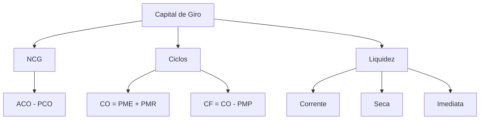

# Capital de Giro

## 1 Introdução

Administração Financeira é a **disciplina mais extensa do Perfil 10** (10 tópicos amplos no edital) e a maior candidata a maior número de questões específicas. O estudo começa pelo Capital de Giro — o sangue da empresa. Sem capital de giro, não há operação.

**Tempo médio recomendado**: 90 minutos.

**Pré-requisitos**: Nenhum. Este é o primeiro capítulo da disciplina.

## 2 Objetivos

Ao final deste capítulo, você será capaz de:

- Definir capital de giro próprio e de terceiros.
- Calcular o ciclo operacional e o ciclo financeiro.
- Determinar a necessidade de capital de giro (NCG).
- Interpretar indicadores de liquidez e prazos médios.

## 3 Conhecimentos Prévios

Nenhum. Capítulo introdutório.

## 4 Desenvolvimento

### 4.1 Conceitos Fundamentais

**Capital de Giro (CG)**: recursos financeiros necessários para manter as operações do dia a dia da empresa — comprar matéria-prima, pagar salários, financiar estoques e contas a receber.

**Capital de Giro Próprio (CGP)**: parte do capital de giro financiada com recursos próprios (patrimônio líquido).

**Capital de Giro de Terceiros (CGT)**: parte financiada com recursos de terceiros (fornecedores, bancos).

**Necessidade de Capital de Giro (NCG)**: valor mínimo de recursos necessários para financiar o ciclo operacional.

$$NCG = \text{Ativo Circulante Operacional} - \text{Passivo Circulante Operacional}$$

Onde:
- **ACO** = estoque + contas a receber + adiantamentos a fornecedores
- **PCO** = fornecedores + salários a pagar + impostos a recolher

### 4.2 Ciclo Operacional e Ciclo Financeiro

| Ciclo | Definição | Fórmula |
|-------|-----------|---------|
| **Ciclo Operacional** | Tempo entre a compra da matéria-prima e o recebimento das vendas. | PME + PMR |
| **Ciclo Financeiro** | Tempo em que a empresa precisa de recursos para financiar suas operações. | CO - PMP |

Onde:
- **PME** = prazo médio de estocagem
- **PMR** = prazo médio de recebimento
- **PMP** = prazo médio de pagamento

> [!attention]
> Se o **Ciclo Financeiro > 0**, a empresa precisa de recursos para financiar o gap. Se **CF < 0**, a empresa recebe antes de pagar (caso raro, típico de varejo à vista).

### 4.3 Indicadores de Liquidez

| Indicador | Fórmula | Interpretação |
|-----------|---------|---------------|
| Liquidez Corrente | AC / PC | > 1 = cobre obrigações de curto prazo |
| Liquidez Seca | (AC - Estoque) / PC | Elimina o estoque (menos líquido) |
| Liquidez Imediata | Disponível / PC | Só considera caixa e equivalentes |

> [!trap]
> Liquidez corrente alta **não significa** saúde financeira. Pode indicar estoque parado ou contas a receber de difícil cobrança. Sempre analise em conjunto com a liquidez seca.

### 4.4 Prazos Médios

$$PME = \frac{\text{Estoque Médio}}{\text{CMV}} \times 360$$

$$PMR = \frac{\text{Contas a Receber Médio}}{\text{Vendas a Prazo}} \times 360$$

$$PMP = \frac{\text{Fornecedores Médio}}{\text{Compras a Prazo}} \times 360$$

## 5 Exemplos

1. Uma empresa tem PME = 60 dias, PMR = 30 dias, PMP = 45 dias.
   - CO = 60 + 30 = 90 dias
   - CF = 90 - 45 = 45 dias → precisa financiar 45 dias de operação.

2. AC = 500.000; PC = 300.000; Estoque = 200.000
   - LC = 500.000 / 300.000 = 1,67 ✅
   - LS = (500.000 - 200.000) / 300.000 = 1,00 ⚠️

## 6 Erros Frequentes

- Confundir capital de giro com capital fixo (imobilizado).
- Esquecer que fornecedores são **fonte** de capital de giro (reduzem a necessidade).
- Aplicar fórmulas de prazo médio sem verificar se os valores são médios ou de final de período.
- Interpretar liquidez corrente isoladamente, sem considerar a composição do ativo circulante.

## 7 Como a FGV Cobra

A FGV cobra Administração Financeira com **contexto empresarial e estudos de caso** — alinhado às atribuições do cargo na DATAPREV. Questões típicas:
- "Dado o balanço de uma empresa, calcule a necessidade de capital de giro."
- "Qual indicador de liquidez mais adequado para avaliar uma empresa com alto estoque?"
- "Se a empresa reduzir seu prazo médio de estocagem, o que acontece com o ciclo financeiro?"

## 8 Questões Comentadas

*(Questões serão adicionadas na fase de produção de conteúdo.)*

## 9 Questões para Resolver

*(Serão disponibilizadas em breve.)*

## 10 Resumo Executivo

- **NCG** = ACO - PCO. Representa o financiamento necessário para o ciclo operacional.
- **Ciclo Operacional** = PME + PMR; **Ciclo Financeiro** = CO - PMP.
- **Liquidez Corrente** = AC/PC; **Liquidez Seca** = (AC - Estoque)/PC.
- **CGP vs. CGT**: próprio = recursos dos acionistas; terceiros = fornecedores e bancos.

## 11 Mapa Mental

## 12 Flashcards

*(Flashcards serão adicionados na fase de produção de conteúdo.)*

## 13 Checklist

- [ ] Sei calcular NCG, CO e CF.
- [ ] Sei interpretar indicadores de liquidez corrente, seca e imediata.
- [ ] Sei calcular prazos médios de estocagem, recebimento e pagamento.
- [ ] Sei distinguir capital de giro próprio de terceiros.
- [ ] Sei resolver questões contextualizadas em estudos de caso.

## 14 Glossário

- **Ativo Circulante Operacional (ACO)**: estoque + contas a receber + adiantamentos.
- **Passivo Circulante Operacional (PCO)**: fornecedores + obrigações operacionais.
- **Ciclo Operacional**: tempo entre compra e recebimento de vendas.
- **Ciclo Financeiro**: tempo de necessidade de financiamento das operações.

## 15 Referências

- Gitman, Lawrence J. *Princípios de Administração Financeira*. 14ª ed. São Paulo: Pearson, 2019.
- Ross, Stephen A.; Westerfield, Randolph W.; Jordan, Bradford D. *Princípios de Administração Financeira*. 12ª ed. São Paulo: Atlas, 2015.
