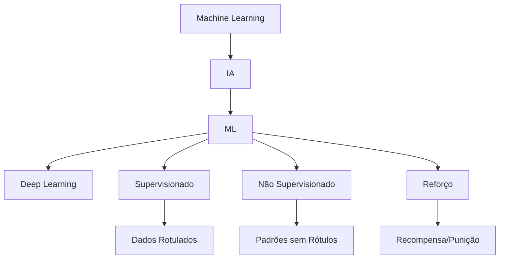

# Machine Learning Básico

## 1 Introdução

A disciplina "Atualidades e Inteligência Artificial" é uma das maiores oportunidades do concurso DATAPREV Perfil 10: **baixo esforço, 6 pontos em jogo**. O bloco de IA é conteúdo novo em concursos, e a FGV tende a cobrar **conceitos fundamentais**, não detalhe técnico.

**Tempo médio recomendado**: 60 minutos.

**Pré-requisitos**: Nenhum. Este é o primeiro capítulo da disciplina.

## 2 Objetivos

Ao final deste capítulo, você será capaz de:

- Definir Inteligência Artificial, Machine Learning e Deep Learning.
- Distinguir os três tipos de aprendizado de máquina.
- Identificar aplicações práticas de cada tipo.
- Reconhecer os riscos e limites da IA em contextos públicos.

## 3 Conhecimentos Prévios

Nenhum. Capítulo introdutório.

## 4 Desenvolvimento

### 4.1 Conceitos Fundamentais

**Inteligência Artificial (IA)**: campo da computação que busca criar sistemas capazes de realizar tarefas que normalmente exigiriam inteligência humana — reconhecimento de padrões, tomada de decisão, compreensão de linguagem.

**Machine Learning (ML)**: subárea da IA em que o sistema **aprende a partir de dados**, em vez de ser explicitamente programado com regras rígidas.

**Deep Learning**: subárea do ML que usa **redes neurais artificiais** com muitas camadas para aprender representações complexas de dados.

**Relação hierárquica:** IA ⊃ Machine Learning ⊃ Deep Learning

### 4.2 Tipos de Aprendizado de Máquina

| Tipo | Definição | Exemplo |
|------|-----------|---------|
| **Supervisionado** | O algoritmo aprende a partir de dados **rotulados** (entrada + saída esperada). | Classificar e-mails como spam ou não spam. |
| **Não supervisionado** | O algoritmo encontra padrões em dados **sem rótulos**. | Agrupar clientes por perfil de consumo. |
| **Por Reforço** | O agente aprende por **tentativa e erro**, recebendo recompensas ou punições. | Treinar um robô para andar ou um carro autônomo. |

> [!attention]
> A FGV pode cobrar a distinção entre esses três tipos em uma questão de múltipla escolha. Memorize: supervisionado = rótulos; não supervisionado = sem rótulos; reforço = recompensa/punição.

### 4.3 Aplicações no Setor Público

- **Previdência**: detecção de fraudes em benefícios (supervisionado).
- **Saúde**: triagem automática de exames (supervisionado).
- **Segurança pública**: análise de padrões criminais (não supervisionado).
- **Trânsito**: otimização de semáforos (reforço).

### 4.4 Limites e Riscos

- **Viés algorítmico**: se os dados de treinamento são tendenciosos, o modelo reproduz o viés.
- **Falta de transparência**: modelos de deep learning são "caixas-pretas" — difíceis de explicar.
- **Dependência de dados**: sem dados de qualidade, não há aprendizado de qualidade.
- **LGPD**: uso de dados pessoais em sistemas de IA deve respeitar a lei (ver disciplina de Legislação de Dados).

## 5 Exemplos

1. Um sistema que prevê inadimplência a partir de histórico de crédito → **aprendizado supervisionado**.
2. Um sistema que descobre grupos de consumidores com comportamentos semelhantes → **aprendizado não supervisionado**.
3. Um sistema que aprende a jogar xadrez vencendo partidas → **aprendizado por reforço**.

## 6 Erros Frequentes

- Confundir IA com ML (ML é subconjunto da IA).
- Achar que "não supervisionado" significa "sem controle humano" — na verdade significa "sem rótulos nos dados".
- Esquecer que a qualidade do modelo depende da qualidade dos dados.

## 7 Como a FGV Cobra

A FGV cobra **conceito**, não código ou matemática. Questões típicas:
- "Qual tipo de aprendizado de máquina é mais adequado para classificar documentos?"
- "O que caracteriza o aprendizado por reforço?"
- "Qual o risco de usar dados históricos tendenciosos em um modelo de IA?"

## 8 Questões Comentadas

*(Questões serão adicionadas na fase de produção de conteúdo.)*

## 9 Questões para Resolver

*(Serão disponibilizadas em breve.)*

## 10 Resumo Executivo

- **IA** = sistemas inteligentes; **ML** = aprendizado por dados; **Deep Learning** = redes neurais profundas.
- **Supervisionado** = dados rotulados; **Não supervisionado** = padrões sem rótulos; **Reforço** = tentativa e erro com recompensa.
- **Riscos**: viés, caixa-preta, qualidade dos dados, LGPD.
- **Estratégia FGV**: domine as definições e exemplos — não aprofunde em matemática.

## 11 Mapa Mental

## 12 Flashcards

*(Flashcards serão adicionados na fase de produção de conteúdo.)*

## 13 Checklist

- [ ] Sei definir IA, ML e Deep Learning.
- [ ] Sei distinguir os três tipos de aprendizado de máquina.
- [ ] Sei dar exemplos práticos de cada tipo.
- [ ] Sei identificar os principais riscos da IA no setor público.
- [ ] Sei relacionar IA e LGPD.

## 14 Glossário

- **Algoritmo**: conjunto de regras para resolver um problema ou executar uma tarefa.
- **Modelo**: resultado do treinamento de um algoritmo sobre dados.
- **Dados rotulados**: dados de entrada acompanhados da resposta correta.
- **Viés algorítmico**: distorção sistemática nas previsões de um modelo devido a dados tendenciosos.

## 15 Referências

- Russell, Stuart; Norvig, Peter. *Artificial Intelligence: A Modern Approach*. 4th ed. Pearson, 2020.
- Goodfellow, Ian; Bengio, Yoshua; Courville, Aaron. *Deep Learning*. MIT Press, 2016.
- Lei 13.709/2018 (LGPD).
