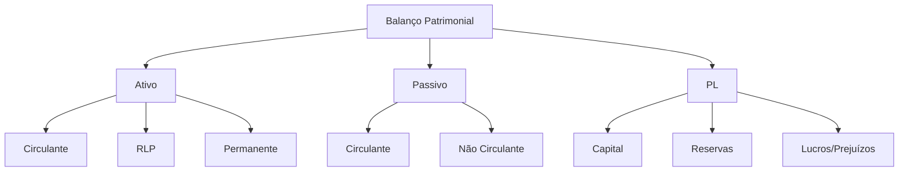

# Balanço Patrimonial

## 1 Introdução

O Balanço Patrimonial é a **foto financeira da empresa em uma data específica**. É o primeiro demonstrativo que todo candidato a áreas financeiras e de controle deve dominar. No DATAPREV Perfil 10, a FGV cobra leitura, estrutura e interpretação do BP com frequência.

**Tempo médio recomendado**: 90 minutos.

**Pré-requisitos**: Nenhum. Este é o primeiro capítulo da disciplina.

## 2 Objetivos

Ao final deste capítulo, você será capaz de:

- Explicar a estrutura do BP e a equação contábil fundamental.
- Identificar e classificar contas do Ativo, Passivo e Patrimônio Líquido.
- Calcular indicadores de liquidez a partir do BP.
- Interpretar variações patrimoniais e suas causas.

## 3 Conhecimentos Prévios

Nenhum. Capítulo introdutório.

## 4 Desenvolvimento

### 4.1 Equação Contábil Fundamental

$$\text{Ativo} = \text{Passivo} + \text{Patrimônio Líquido}$$

Ou, de forma equivalente:

$$\text{Ativo} - \text{Passivo} = \text{Patrimônio Líquido}$$

O **Ativo** representa tudo que a empresa **possui** e tem direito de receber. O **Passivo** representa tudo que a empresa **deve**. O **Patrimônio Líquido** representa o **valor que pertence aos sócios**.

> [!attention]
> A FGV adora testar se você entende que **toda operação afeta pelo menos duas contas** (partidas dobradas). Se aumenta o ativo, ou aumenta o passivo/PL, ou diminui outro ativo.

### 4.2 Estrutura do Ativo

| Grupo | Contas Típicas | Liquidez |
|-------|---------------|----------|
| **Ativo Circulante** | Caixa, bancos, aplicações, contas a receber, estoques | Alta |
| **Ativo Realizável a Longo Prazo** | Contas a receber de LP, investimentos em coligadas | Média |
| **Ativo Permanente** | Imobilizado, intangível, investimentos | Baixa |

> [!trap]
> A classificação entre circulante e não circulante depende do **prazo de realização** (≤ 12 meses = circulante). Umesmo tipo de conta pode estar em grupos diferentes dependendo do prazo.

### 4.3 Estrutura do Passivo

| Grupo | Contas Típicas | Prazo |
|-------|---------------|-------|
| **Passivo Circulante** | Fornecedores, empréstimos de curto prazo, impostos a pagar, salários | ≤ 12 meses |
| **Passivo Não Circulante** | Empréstimos de longo prazo, provisões para contingências de LP | > 12 meses |
| **Patrimônio Líquido** | Capital social, reservas, lucros/prejuízos acumulados | Indefinido |

### 4.4 Indicadores de Liquidez a partir do BP

| Indicador | Fórmula | O que mede |
|-----------|---------|------------|
| Liquidez Corrente | AC / PC | Capacidade de pagar dívidas de curto prazo |
| Liquidez Seca | (AC - Estoque) / PC | Mesmo, excluindo estoque (menos líquido) |
| Liquidez Geral | (AC + RLP) / (PC + PNC) | Capacidade de pagar todas as dívidas |
| Liquidez Imediata | Disponível / PC | Capacidade de pagar apenas com caixa |
| Solvência Geral | Ativo Total / Passivo Total | Capacidade de pagar todas as dívidas com todos os ativos |

> [!attention]
> **Solvência ≠ Liquidez**. Liquidez é capacidade de pagar dívidas de curto prazo. Solvência é capacidade de pagar todas as dívidas (inclusive de longo prazo).

### 4.5 Variações Patrimoniais

**Aumento do PL** pode ocorrer por:
- Aporte de capital pelos sócios
- Lucro do exercício
- Reavaliação de ativos

**Diminuição do PL** pode ocorrer por:
- Prejuízo do exercício
- Distribuição de dividendos
- Resgate de capital

## 5 Exemplos

1. Uma empresa compra mercadoria a prazo de R$ 50.000:
   - Estoque (Ativo) ↑ 50.000
   - Fornecedores (Passivo) ↑ 50.000
   - PL não se altera

2. Uma empresa paga R$ 20.000 de empréstimo:
   - Caixa (Ativo) ↓ 20.000
   - Empréstimo (Passivo) ↓ 20.000
   - PL não se altera

3. Uma empresa tem lucro de R$ 100.000:
   - Caixa/Contas a Receber (Ativo) ↑ 100.000
   - Lucros Acumulados (PL) ↑ 100.000

## 6 Erros Frequentes

- Confundir Ativo com "despesa" ou Passivo com "receita".
- Esquecer que a compra a prazo aumenta Ativo **e** Passivo (não afeta PL).
- Interpretar liquidez corrente sem considerar a composição do AC.
- Confundir lucro (DRE) com aumento de PL (BP são demonstrativos distintos, mas relacionados).

## 7 Como a FGV Cobra

A FGV cobra BP de duas formas:
1. **Questões estruturais**: "Qual das operações abaixo altera o Patrimônio Líquido?"
2. **Questões de cálculo**: "Dado o BP, calcule a liquidez seca e a solvência geral."

A pegadinha clássica é oferecer uma operação que parece afetar o PL, mas não afeta (ex: compra a vista — troca de ativo por ativo).

## 8 Questões Comentadas

*(Questões serão adicionadas na fase de produção de conteúdo.)*

## 9 Questões para Resolver

*(Serão disponibilizadas em breve.)*

## 10 Resumo Executivo

- **Equação**: Ativo = Passivo + PL.
- **Ativo**: o que a empresa possui (circulante, RLP, permanente).
- **Passivo**: o que a empresa deve (circulante, não circulante).
- **PL**: valor dos sócios (capital, reservas, lucros/prejuízos).
- **Indicadores**: liquidez corrente, seca, geral, imediata; solvência geral.

## 11 Mapa Mental

## 12 Flashcards

*(Flashcards serão adicionados na fase de produção de conteúdo.)*

## 13 Checklist

- [ ] Sei explicar a equação contábil fundamental.
- [ ] Sei classificar contas no Ativo, Passivo e PL.
- [ ] Sei calcular os 5 indicadores de liquidez/solvência.
- [ ] Sei identificar quais operações alteram o PL.
- [ ] Sei interpretar um BP em questões de múltipla escolha.

## 14 Glossário

- **Ativo**: recursos controlados pela entidade com potencial de gerar benefícios futuros.
- **Passivo**: obrigações presentes da entidade.
- **Patrimônio Líquido**: participação residual nos ativos após deduzir todos os passivos.
- **Liquidez**: capacidade de converter ativos em dinheiro.
- **Solvência**: capacidade de honrar todas as obrigações (curto e longo prazo).

## 15 Referências

- Iudícibus, Sérgio de. *Teoria da Contabilidade*. 11ª ed. São Paulo: Atlas, 2020.
- Marion, José Carlos. *Contabilidade Empresarial*. 18ª ed. São Paulo: Atlas, 2021.
- CPC 00 (R2) — Estrutura Conceitual para Relatório Financeiro.
