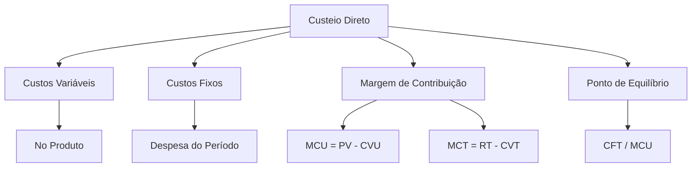

# Custeio Direto/Variável

## 1 Introdução

A disciplina de Custos no DATAPREV Perfil 10 tem um **recorte mais enxuto** que a Contabilidade de Custos tradicional de concursos. A FGV foca em métodos de custeio, margem de contribuição, ponto de equilíbrio e markup — com **alta proporção de questões quantitativas curtas**. Este capítulo cobre o primeiro método: o Custeio Direto (também chamado Custeio Variável).

**Tempo médio recomendado**: 60 minutos.

**Pré-requisitos**: Nenhum. Este é o primeiro capítulo da disciplina.

## 2 Objetivos

Ao final deste capítulo, você será capaz de:

- Distinguir custos fixos de custos variáveis.
- Calcular o custo direto de um produto ou serviço.
- Interpretar a margem de contribuição unitária e total.
- Comparar os resultados do custeio direto com o custeio por absorção.

## 3 Conhecimentos Prévios

Nenhum. Capítulo introdutório.

## 4 Desenvolvimento

### 4.1 Custos Fixos vs. Custos Variáveis

| Característica | Custos Fixos | Custos Variáveis |
|----------------|--------------|------------------|
| **Comportamento** | Não variam com o volume de produção | Variam proporcionalmente ao volume |
| **Exemplos** | Aluguel, salários fixos, depreciação | Matéria-prima, mão de obra direta, energia produtiva |
| **Por unidade** | Diminuem à medida que a produção aumenta | Permanecem constantes por unidade |
| **No custeio direto** | Considerados **despesa do período** | Considerados **custo do produto** |

> [!attention]
> A distinção entre fixo e variável depende do **relevant range** (intervalo de atividade). Um custo fixo só é fixo dentro de um certo intervalo de produção. Acima desse intervalo, pode aumentar (ex: novo turno de trabalho).

### 4.2 Custeio Direto (Variável)

No **Custeio Direto**, apenas os **custos variáveis** são atribuídos aos produtos. Os **custos fixos** são tratados como **despesas do período** e abatidos diretamente do resultado.

**Vantagens:**
- Facilita a análise de decisões de curto prazo (aceitar ou rejeitar pedido especial).
- Evita distorções causadas por rateios arbitrários de custos fixos.
- Útil para empresas com múltiplos produtos.

**Desvantagens:**
- Não atende às normas contábeis brasileiras (CPC 16 / Lei 6.404/76 exigem custeio por absorção para fins fiscais).
- Pode subestimar o custo total do produto.

### 4.3 Margem de Contribuição

A **margem de contribuição unitária (MCU)** é a diferença entre preço de venda e custo variável unitário:

$$MCU = PV - CVU$$

A **margem de contribuição total (MCT)**:

$$MCT = \text{Receita Total} - \text{Custos Variáveis Totais}$$

O **resultado no custeio direto**:

$$\text{Resultado} = MCT - \text{Custos Fixos Totais}$$

> [!trap]
> Margem de contribuição **positiva** não significa lucro — significa que o produto cobre seus custos variáveis e ainda contribui para cobrir os fixos. Lucro só existe se MCT > CFT.

### 4.4 Comparação com Custeio por Absorção

| Aspecto | Custeio Direto | Custeio por Absorção |
|---------|----------------|----------------------|
| Custos no produto | Apenas variáveis | Todos (fixos + variáveis) |
| Custos fixos | Despesa do período | Rateados aos produtos |
| Resultado | Mais volátil com volume | Menos volátil |
| Uso | Decisão gerencial | Relatórios contábeis/fiscais |

> [!attention]
> Quando o estoque aumenta, o custeio por absorção mostra **maior lucro** (parte dos custos fixos fica no estoque). Quando o estoque diminui, o custeio direto mostra maior lucro. A FGV cobra essa diferença.

## 5 Exemplos

1. Uma empresa produz um produto com PV = R$ 100, CVU = R$ 60, CFT = R$ 10.000.
   - MCU = 100 - 60 = R$ 40
   - Para lucrar: MCT > 10.000 → Q > 10.000 / 40 = 250 unidades

2. Se produzir 300 unidades:
   - MCT = 300 × 40 = 12.000
   - Resultado = 12.000 - 10.000 = R$ 2.000 (lucro)

## 6 Erros Frequentes

- Incluir custos fixos no custo do produto no custeio direto.
- Confundir margem de contribuição com lucro líquido.
- Esquecer que custeio direto não é aceito para fins fiscais no Brasil.
- Não considerar o efeito do estoque na comparação entre os dois métodos.

## 7 Como a FGV Cobra

A FGV cobra custos com **questões quantitativas curtas**:
- "Dados PV, CVU e CFT, qual a margem de contribuição unitária?"
- "Quantas unidades devem ser vendidas para atingir o ponto de equilíbrio?"
- "Qual método de custeio apresenta maior lucro quando o estoque aumenta?"

**Estratégia**: treine cálculo rápido. As questões são diretas, mas exigem agilidade.

## 8 Questões Comentadas

*(Questões serão adicionadas na fase de produção de conteúdo.)*

## 9 Questões para Resolver

*(Serão disponibilizadas em breve.)*

## 10 Resumo Executivo

- **Custeio Direto**: apenas custos variáveis vão para o produto; fixos são despesa.
- **Margem de Contribuição**: PV - CVU. Mede a contribuição de cada unidade para cobrir fixos.
- **Ponto de Equilíbrio**: CFT / MCU. Volume mínimo para não ter prejuízo.
- **Diferença com absorção**: estoque absorve parte dos custos fixos → lucro diferente.

## 11 Mapa Mental

## 12 Flashcards

*(Flashcards serão adicionados na fase de produção de conteúdo.)*

## 13 Checklist

- [ ] Sei distinguir custos fixos de variáveis.
- [ ] Sei calcular margem de contribuição unitária e total.
- [ ] Sei calcular o ponto de equilíbrio no custeio direto.
- [ ] Sei comparar resultados entre custeio direto e absorção.
- [ ] Sei resolver questões quantitativas curtas da FGV sobre custos.

## 14 Glossário

- **Custo fixo**: custo que não varia com o volume de produção no relevant range.
- **Custo variável**: custo que varia proporcionalmente ao volume de produção.
- **Margem de contribuição**: diferença entre receita e custos variáveis.
- **Relevant range**: intervalo de atividade onde o comportamento dos custos é previsível.

## 15 Referências

- Martins, Eliseu. *Contabilidade de Custos*. 11ª ed. São Paulo: Atlas, 2021.
- Padoveze, Clóvis Luís. *Contabilidade Gerencial: Abordagem da Gestão Contábil com ênfase em Custos*. 4ª ed. São Paulo: Atlas, 2019.
