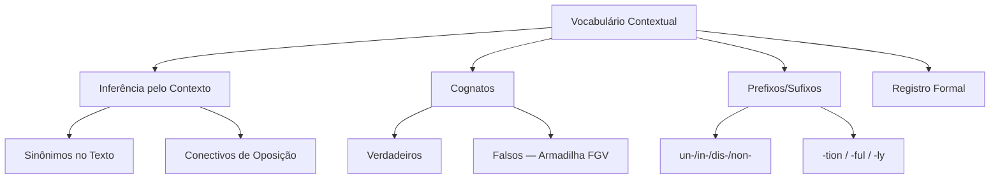

# Vocabulário Contextual

## 1 Introdução

A prova de Língua Inglesa do DATAPREV (Perfil 10) não cobra tradução literal. O que a FGV exige é **compreensão de textos** — identificar a ideia principal, inferir significados pelo contexto e reconhecer pegadinhas comuns. O primeiro passo para dominar isso é construir um vocabulário contextual sólido.

**Tempo médio recomendado**: 90 minutos.

**Pré-requisitos**: Nenhum. Este é o primeiro capítulo da disciplina.

## 2 Objetivos

Ao final deste capítulo, você será capaz de:

- Inferir o significado de palavras desconhecidas pelo contexto.
- Identificar cognatos verdadeiros e falsos cognatos.
- Reconhecer prefixos e sufixos comuns que alteram o sentido.
- Distinguir registro formal de informal em textos.

## 3 Conhecimentos Prévios

Nenhum. Capítulo introdutório.

## 4 Desenvolvimento

### 4.1 Inferência pelo Contexto

A técnica mais poderosa para a prova é **não traduzir palavra por palavra**. Em vez disso, leia a frase inteira e identifique:

- **Sinônimos ou explicações no próprio texto** (ex: *"The company faced a crisis, a severe emergency that required immediate action."* → "crisis" = "emergency").
- **Conectivos de oposição** (however, although, but) que mudam a direção do sentido.
- **Exemplos ilustrativos** (for example, such as) que clarificam o termo anterior.

### 4.2 Cognatos e Falsos Cognatos

**Cognatos verdadeiros** são palavras com etimologia comum e significado semelhante:

| Inglês | Português |
|--------|-----------|
| important | importante |
| possible | possível |
| information | informação |

**Falsos cognatos** são armadilhas da FGV:

| Inglês | Significado Real | Erro Comum |
|--------|------------------|------------|
| actually | na verdade, de fato | "atualmente" ❌ |
| event | evento | "eventualmente" ❌ |
| realize | perceber, dar-se conta | "realizar" ❌ |
| push | empurrar | "puxar" ❌ |
| legend | lenda | "legenda (de filme)" ❌ |

> [!trap]
> A FGV adora colocar falsos cognatos nas alternativas. Quando você vê uma palavra que "parece" português, desconfie. Verifique o contexto antes de marcar.

### 4.3 Prefixos e Sufixos

Reconhecer afixos comuns acelera a inferência:

**Prefixos negativos:** un-, in-, im-, dis-, non-
- *un*happy = infeliz; *dis*agree = discordar; *non*profit = sem fins lucrativos

**Sufixos de categoria:**
- *-tion / -sion* = substantivo (action, decision)
- *-ful / -less* = qualidade (useful, useless)
- *-ly* = advérbio (quickly, unfortunately)

### 4.4 Registro e Tom

A FGV utiliza textos de fontes jornalísticas, acadêmicas e econômicas. Palavras como *however, therefore, furthermore, nevertheless* indicam registro formal. Expressões como *gonna, wanna, kinda* indicam registro informal e **nunca** aparecem na prova.

## 5 Exemplos

1. *"The **outcome** of the negotiations was **unexpected**, since both parties had previously agreed on the terms."*
   - "outcome" = resultado (inferido pelo contexto de "negotiations")
   - "unexpected" = inesperado (prefixo un- + expected)

2. *"She is **responsible** for the project."*
   - "responsible" = responsável (cognato verdadeiro)

3. *"The **fabric** of society is complex."*
   - "fabric" aqui não é "fábrica" ❌, mas "tecido, estrutura" ✅

## 6 Erros Frequentes

- Traduzir literalmente palavra por palavra em vez de ler o parágrafo inteiro.
- Cair em falsos cognatos sem verificar o contexto.
- Ignorar conectivos que indicam oposição, causa ou consequência.
- Confundir homônimos (palavras iguais, sentidos diferentes): *bank* (banco/ margem de rio), *right* (certo/ direito).

## 7 Como a FGV Cobra

A banca privilegia:
- **Identificação de ideia principal** (main idea).
- **Inferência** (o autor quer dizer que...).
- **Referentes** ("it", "they", "this" se referem a quem?).

As alternativas costumam conter uma opção parcialmente correta (distrator), uma opção que inverte a lógica do texto e uma que é literalmente impossível de ser inferida.

## 8 Questões Comentadas

*(Questões serão adicionadas na fase de produção de conteúdo.)*

## 9 Questões para Resolver

*(Serão disponibilizadas em breve.)*

## 10 Resumo Executivo

- **Não traduza palavra por palavra** — leia o contexto.
- **Desconfie de cognatos** — verifique se o sentido real bate com o português.
- **Prefixos e sufixos** aceleram a inferência de palavras desconhecidas.
- **Conectivos** são pistas de como as ideias se relacionam.

## 11 Mapa Mental

## 12 Flashcards

*(Flashcards serão adicionados na fase de produção de conteúdo.)*

## 13 Checklist

- [ ] Sei inferir significado pelo contexto sem traduzir literalmente.
- [ ] Sei identificar falsos cognatos comuns da prova FGV.
- [ ] Sei reconhecer prefixos e sufixos que alteram o sentido.
- [ ] Sei distinguir registro formal de informal.
- [ ] Sei reconheger conectivos de oposição, causa e consequência.

## 14 Glossário

- **Cognato**: palavra de mesma origem etimológica em duas línguas.
- **Falso cognato**: palavra que parece ter o mesmo sentido, mas não tem.
- **Inferência**: conclusão tirada a partir de evidências e raciocínio.

## 15 Referências

- Murphy, Raymond. *English Grammar in Use*. 5th ed. Cambridge University Press, 2019.
- Fellbaum, Christiane (ed.). *WordNet: An Electronic Lexical Database*. MIT Press, 1998.
