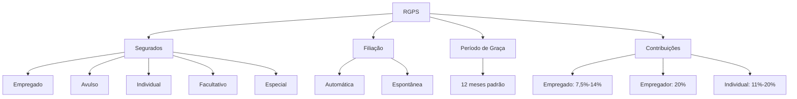

# RGPS e Segurados

## 1 Introdução

A disciplina de Legislação Previdenciária e Trabalhista é **essencialmente de lei seca com recorte definido**. A FGV cobra **literalidade** — prazos, percentuais, conceitos. Como a DATAPREV é a gestora da previdência social no Brasil, este tema é diretamente ligado ao negócio da empresa e às atribuições do cargo. Espere contextualização institucional.

**Tempo médio recomendado**: 90 minutos.

**Pré-requisitos**: Nenhum. Este é o primeiro capítulo da disciplina.

## 2 Objetivos

Ao final deste capítulo, você será capaz de:

- Definir RGPS e seus objetivos.
- Classificar os segurados do RGPS (obrigatórios, facultativos, especiais).
- Explicar as regras de filiação, qualidade de segurado e período de graça.
- Identificar as contribuições previdenciárias e seus respectivos financiadores.

## 3 Conhecimentos Prévios

Nenhum. Capítulo introdutório.

## 4 Desenvolvimento

### 4.1 O que é o RGPS?

O **Regime Geral de Previdência Social (RGPS)** é o sistema público de previdência social brasileiro, administrado pelo INSS (Instituto Nacional do Seguro Social), vinculado ao Ministério da Previdência Social. O RGPS é regido pela Lei 8.213/1991 (Lei Orgânica da Previdência Social) e pelas Emendas Constitucionais 20/1998, 41/2003 e 103/2019.

**Objetivos do RGPS (art. 201, CF):**
- Cobertura dos eventos de doença, invalidez, morte e idade avançada.
- Proteção à maternidade.
- Proteção ao trabalhador em caso de desemprego involuntário (seguro-desemprego é do FAT, mas integra a proteção social).

### 4.2 Segurados do RGPS

| Categoria | Definição | Exemplos |
|-----------|-----------|----------|
| **Empregado** | Pessoa física que presta serviço de natureza não eventual a empregador, sob dependência e salário. | CLT, doméstico, avulso. |
| **Trabalhador Avulso** | Pessoa que presta serviço de natureza urbana ou rural, por conta de tomadores de serviços, com intermediação de sindicato ou órgão gestor de mão de obra. | Estivador, capataz, jornaleiro. |
| **Contribuinte Individual** | Pessoa que trabalha por conta própria, sem relação de emprego. | Profissional liberal, autônomo, MEI. |
| **Segurado Facultativo** | Pessoa não obrigada a filiar-se ao RGPS, que se filia espontaneamente. | Dona de casa, estudante, desempregado com recursos próprios. |
| **Segurado Especial** | Trabalhador rural de pequena produção, pescador artesanal, índio. | Pequeno produtor rural, ribeirinho. |

> [!attention]
> A FGV ama confundir **segurado facultativo** com **contribuinte individual**. O facultativo não tem atividade remunerada; o contribuinte individual trabalha por conta própria.

### 4.3 Filiação e Qualidade de Segurado

**Filiação**: ato de inscrição no RGPS, que pode ser:
- **Automática**: para empregados (empregador é obrigado a inscrever).
- **Espontânea**: para contribuinte individual e facultativo.

**Qualidade de segurado**: condição que habilita o segurado a requerer benefícios. É adquirida com:
- **Inscrição** no RGPS (data de filiação).
- **Pagamento** da primeira contribuição (para contribuintes individuais e facultativos).

> [!trap]
> Qualidade de segurado é **adquirida** e pode ser **perdida**. A perda ocorre por falta de recolhimento de contribuições por período superior ao período de graça.

### 4.4 Período de Graça

O **período de graça** é o prazo após a cessação das contribuições em que o segurado **mantém a qualidade de segurado** e pode requerer benefícios:

| Situação | Período de Graça |
|----------|------------------|
| Empregado, após rescisão | 12 meses |
| Contribuinte individual/facultativo, após recolhimento mensal | 12 meses |
| Contribuinte individual/facultativo, após recolhimento trimestral/quadrimestral | 12 meses |
| Segurado especial | 12 meses |

> [!attention]
> O período de graça de 12 meses é o **padrão** para a maioria dos segurados. A FGV cobra isso com frequência.

### 4.5 Contribuições Previdenciárias

| Tipo | Alíquota (padrão) | Quem paga |
|------|-------------------|-----------|
| Empregado (CLT) | 7,5% a 14% (progressiva) | Empregado (descontado em folha) |
| Empregador | 20% sobre a folha | Empregador |
| Contribuinte Individual | 11% a 20% sobre salário-de-contribuição | Próprio segurado |
| Facultativo | 11% a 20% sobre salário-de-contribuição | Próprio segurado |

> [!trap]
> As alíquotas do empregado são **progressivas** (EC 103/2019). A FGV pode cobrar os limites de cada faixa. Memorize: até um salário-mínimo = isento; acima disso, faixas progressivas.

## 5 Exemplos

1. Maria foi demitida em janeiro de 2026. Ela pode requerer benefícios do RGPS até janeiro de 2027 → **período de graça de 12 meses**.
2. João é advogado autônomo → **contribuinte individual** (não facultativo, pois trabalha por conta própria).
3. Ana é dona de casa sem renda própria e se filia ao RGPS → **segurada facultativa**.

## 6 Erros Frequentes

- Confundir segurado facultativo com contribuinte individual.
- Esquecer que o período de graça padrão é 12 meses.
- Achar que empregado doméstico não é segurado do RGPS (é, mas com regras específicas).
- Confundir as alíquotas do empregado com as do empregador.

## 7 Como a FGV Cobra

A FGV cobra previdência com **lei seca e contextualização na DATAPREV**:
- "Qual o período de graça de um empregado após rescisão do contrato?"
- "Quem é considerado segurado especial do RGPS?"
- "Qual a alíquota de contribuição do empregador sobre a folha de pagamentos?"

A pegadinha é quase sempre a **classificação do segurado** ou o **período de graça**.

## 8 Questões Comentadas

*(Questões serão adicionadas na fase de produção de conteúdo.)*

## 9 Questões para Resolver

*(Serão disponibilizadas em breve.)*

## 10 Resumo Executivo

- **RGPS**: regime público de previdência, administrado pelo INSS.
- **Segurados**: empregado, avulso, contribuinte individual, facultativo, especial.
- **Período de graça**: 12 meses (padrão) após cessação das contribuições.
- **Contribuições**: empregado (progressiva 7,5%–14%), empregador (20%), individual/facultativo (11%–20%).
- **FGV**: foco em classificação de segurados, período de graça e alíquotas.

## 11 Mapa Mental

## 12 Flashcards

*(Flashcards serão adicionados na fase de produção de conteúdo.)*

## 13 Checklist

- [ ] Sei definir RGPS e seus objetivos.
- [ ] Sei classificar os 5 tipos de segurados do RGPS.
- [ ] Sei explicar filiação automática vs. espontânea.
- [ ] Sei o período de graça padrão e suas exceções.
- [ ] Sei as principais alíquotas de contribuição previdenciária.
- [ ] Sei reconhecer as pegadinhas da FGV sobre classificação de segurados.

## 14 Glossário

- **INSS**: Instituto Nacional do Seguro Social.
- **Salário-de-contribuição**: base de cálculo das contribuições previdenciárias.
- **Qualidade de segurado**: condição necessária para requerer benefícios.
- **Período de graça**: prazo em que o segurado mantém a qualidade sem contribuir.
- **Benefício**: prestação paga pelo RGPS em caso de ocorrência do evento segurado.

## 15 Referências

- Lei nº 8.213/1991 (Lei Orgânica da Previdência Social).
- Constituição Federal, art. 201.
- EC 103/2019 (Reforma da Previdência).
- Maluf, Carlos Alberto. *Direito Previdenciário Esquematizado*. 9ª ed. São Paulo: Saraiva, 2021.
