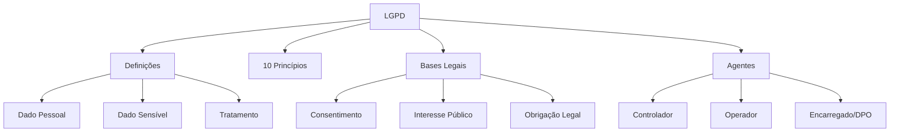

# Princípios e Fundamentos da LGPD

## 1 Introdução

A Lei Geral de Proteção de Dados (Lei 13.709/2018) é a pedra angular da disciplina de Legislação de Segurança da Informação no DATAPREV Perfil 10. Com recorte definido no edital (capítulos I–IV), a LGPD é conteúdo **finito e previsível** — uma oportunidade de pontuar com segurança.

**Tempo médio recomendado**: 60 minutos.

**Pré-requisitos**: Nenhum. Este é o primeiro capítulo da disciplina.

## 2 Objetivos

Ao final deste capítulo, você será capaz de:

- Definir dado pessoal, dado pessoal sensível e tratamento.
- Listar os 10 princípios da LGPD.
- Identificar as bases legais para tratamento de dados.
- Distinguir controlador, operador e encarregado.

## 3 Conhecimentos Prévios

Nenhum. Capítulo introdutório.

## 4 Desenvolvimento

### 4.1 Definições Fundamentais (Art. 5º)

**Dado pessoal**: informação relacionada a pessoa natural identificada ou identificável.
- Exemplos: nome, CPF, e-mail, endereço IP, cookies.

**Dado pessoal sensível** (Art. 5º, II): dado sobre origem racial ou étnica, convicção religiosa, opinião política, filiação a sindicato, saúde, vida sexual, dado genético ou biométrico.
- **Regra**: tratamento só é permitido em hipóteses específicas (art. 11º).

**Tratamento**: toda operação realizada com dados pessoais (coleta, produção, recepção, classificação, utilização, acesso, reprodução, transmissão, distribuição, processamento, arquivamento, armazenamento, eliminação, avaliação ou controle da informação, modificação, comunicação, transferência, difusão ou extração).

> [!attention]
> A FGV adora confundir **dado pessoal** com **dado sensível**. "Número de telefone" é pessoal, mas não sensível. "Dado de saúde" é sensível. Leia as alternativas com atenção.

### 4.2 Os 10 Princípios (Art. 6º)

| Princípio | Significado |
|-----------|-------------|
| **Finalidade** | Tratamento para propósitos legítimos, explícitos e informados. |
| **Adequação** | Compatibilidade entre o tratamento e as finalidades informadas. |
| **Necessidade** | Limitação ao mínimo necessário para a realização das finalidades. |
| **Livre acesso** | Garantia ao titular de consulta facilitada sobre dados e duração do tratamento. |
| **Qualidade dos dados** | Garantia de exatidão, clareza, relevância e atualização. |
| **Transparência** | Informação clara, precisa e facilmente acessível sobre o tratamento. |
| **Segurança** | Uso de medidas técnicas e administrativas aptas a proteger os dados. |
| **Prevenção** | Adoção de medidas para prevenir a ocorrência de danos. |
| **Não discriminação** | Impossibilidade de uso para fins discriminatórios, ilícitos ou abusivos. |
| **Responsabilização e prestação de contas** | Demonstração da adoção de medidas eficazes e capacidade de comprovação. |

### 4.3 Bases Legais para Tratamento (Art. 7º)

O tratamento de dados pessoais só é lícito quando realizado com base em uma das 10 hipóteses do art. 7º, incluindo:
- Consentimento do titular (com regras específicas de manifestação livre, informada e inequívoca).
- Cumprimento de obrigação legal ou regulatória.
- Execução de contrato.
- Exercício regular de direitos em processo judicial, administrativo ou arbitral.
- Proteção da vida ou da incolumidade física do titular ou de terceiro.
- Interesse público (administração pública).

> [!trap]
> O **consentimento não é a única base legal**. A administração pública pode tratar dados com base em **interesse público** ou **cumprimento de obrigação legal**, sem necessidade de consentimento. A FGV cobra isso direto.

### 4.4 Agentes de Tratamento

| Agente | Função |
|--------|--------|
| **Controlador** | Pessoa natural ou jurídica que decide sobre o tratamento (quem manda). |
| **Operador** | Quem realiza o tratamento por conta do controlador (quem executa). |
| **Encarregado (DPO)** | Pessoa indicada pelo controlador para atuar como canal de comunicação com o titular e a ANPD. |

## 5 Exemplos

1. A DATAPREV coleta CPF e endereço para pagamento de benefícios → **dado pessoal**, base legal: **interesse público**.
2. Um hospital armazena prontuário médico → **dado sensível**, exige hipótese do art. 11º.
3. Uma empresa contrata terceiro para fazer backup de dados → o terceiro é **operador**.

## 6 Erros Frequentes

- Confundir dado pessoal com dado sensível.
- Achar que consentimento é sempre necessário (administração pública tem bases alternativas).
- Esquecer que "encarregado" e "DPO" são a mesma função.
- Confundir controlador (quem decide) com operador (quem executa).

## 7 Como a FGV Cobra

A FGV cobra **lei seca com recorte definido**. Questões típicas:
- "Qual dos seguintes é considerado dado pessoal sensível pela LGPD?"
- "Qual princípio da LGPD exige que o tratamento seja limitado ao mínimo necessário?"
- "A administração pública pode tratar dados pessoais sem consentimento com base em...?"

A pegadinha clássica: atribuir conceitos da LGPD à LAI ou ao Marco Civil.

## 8 Questões Comentadas

*(Questões serão adicionadas na fase de produção de conteúdo.)*

## 9 Questões para Resolver

*(Serão disponibilizadas em breve.)*

## 10 Resumo Executivo

- **Dado pessoal**: identifica pessoa natural; **sensível**: raça, religião, saúde, etc.
- **10 princípios**: finalidade, adequação, necessidade, livre acesso, qualidade, transparência, segurança, prevenção, não discriminação, responsabilização.
- **Bases legais**: 10 hipóteses do art. 7º; administração pública usa **interesse público**.
- **Agentes**: controlador (decide), operador (executa), encarregado/DPO (comunicação).

## 11 Mapa Mental

## 12 Flashcards

*(Flashcards serão adicionados na fase de produção de conteúdo.)*

## 13 Checklist

- [ ] Sei definir dado pessoal e dado sensível.
- [ ] Sei listar os 10 princípios da LGPD.
- [ ] Sei identificar as principais bases legais de tratamento.
- [ ] Sei distinguir controlador, operador e encarregado.
- [ ] Sei reconhecer as pegadinhas da FGV sobre LGPD vs. LAI.

## 14 Glossário

- **Titular**: pessoa natural a quem se referem os dados pessoais.
- **ANPD**: Autoridade Nacional de Proteção de Dados.
- **DPO**: Data Protection Officer (Encarregado).
- **Relatório de Impacto**: documento que descreve processos de tratamento de dados pessoais que podem gerar riscos.

## 15 Referências

- Lei nº 13.709/2018 (Lei Geral de Proteção de Dados — LGPD).
- Medida Provisória nº 869/2018 (conversão da LGPD).
- Pimentel, Luiz. *Manual de Proteção de Dados*. 2ª ed. São Paulo: Quartier Latin, 2021.
