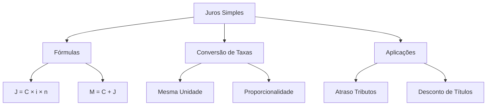

# Juros Simples

## 1 Introdução

Matemática Financeira é a **disciplina-base de todo o bloco quantitativo** do DATAPREV Perfil 10. Conceitos de juros, taxas e capitalização reaparecem em Administração Financeira e Avaliação de Projetos. Dominar o básico agora poupa horas de estudo depois.

**Tempo médio recomendado**: 60 minutos.

**Pré-requisitos**: Nenhum. Este é o primeiro capítulo da disciplina.

## 2 Objetivos

Ao final deste capítulo, você será capaz de:

- Calcular juros simples, capital, taxa, tempo e montante.
- Converter taxas entre unidades de tempo (dia, mês, ano).
- Resolver problemas de aplicação financeira com juros simples.
- Reconhecer a diferença entre taxa nominal e taxa proporcional.

## 3 Conhecimentos Prévios

Nenhum. Capítulo introdutório.

## 4 Desenvolvimento

### 4.1 Conceitos Fundamentais

**Capital (C ou PV)**: valor inicial aplicado ou emprestado.

**Juros (J)**: remuneração do capital ao longo do tempo.

**Taxa (i)**: percentual que incide sobre o capital por unidade de tempo.

**Tempo (t ou n)**: período de duração da aplicação.

**Montante (M ou FV)**: capital + juros acumulados.

### 4.2 Fórmulas Básicas

$$J = C \times i \times n$$

$$M = C + J = C \times (1 + i \times n)$$

Onde:
- $J$ = juros
- $C$ = capital
- $i$ = taxa de juros (na forma unitária: 10% = 0,10)
- $n$ = número de períodos
- $M$ = montante

> [!attention]
> A taxa **i** e o prazo **n** devem estar na **mesma unidade de tempo**. Se a taxa é mensal, o prazo deve ser em meses. Se a taxa é anual, o prazo em anos.

### 4.3 Conversão de Taxas (Proporcionalidade)

No regime de juros simples, a conversão de taxas é feita por **regra de três simples** (proporcionalidade direta):

- 12% ao ano = 1% ao mês (÷ 12)
- 0,5% ao dia = 15% ao mês (× 30)
- 3% ao trimestre = 12% ao ano (× 4)

> [!trap]
> A FGV costuma dar a taxa em uma unidade e o prazo em outra. **Sempre converta antes de aplicar a fórmula.**

### 4.4 Exercício-Modelo

*Um capital de R$ 10.000,00 é aplicado a juros simples de 2% ao mês por 5 meses. Qual o montante ao final?*

Solução:
- $C = 10.000$
- $i = 0,02$
- $n = 5$
- $J = 10.000 \times 0,02 \times 5 = 1.000$
- $M = 10.000 + 1.000 = \text{R\$ } 11.000,00$

## 5 Exemplos

1. R$ 5.000 aplicados a 1,5% a.m. por 8 meses → $J = 5.000 \times 0,015 \times 8 = \text{R\$ } 600,00$.
2. Quanto tempo leva para R$ 8.000 gerar R$ 1.600 de juros a 4% a.m.? → $n = \frac{1.600}{8.000 \times 0,04} = 5$ meses.
3. Qual a taxa mensal que transforma R$ 12.000 em R$ 15.600 em 1 ano? → $i = \frac{3.600}{12.000 \times 12} = 0,025 = 2,5\%$ a.m.

## 6 Erros Frequentes

- Não converter taxa e prazo para a mesma unidade.
- Usar a taxa em percentual na fórmula (10% deve virar 0,10).
- Confundir juros simples com juros compostos.
- Esquecer que no regime simples os juros são **lineares** (crescem de forma constante).

## 7 Como a FGV Cobra

A FGV cobra juros simples em **contextos administrativos**: atraso no pagamento de tributos, aplicação de recursos em curto prazo, desconto de títulos. A pegadinha é quase sempre a **incompatibilidade de unidades** entre taxa e prazo.

## 8 Questões Comentadas

### Questão 1 (FGV — adaptada)

Um tributo de R$ 12.000,00 foi pago com atraso de 45 dias. Sabendo que a taxa de juros de mora é de 0,1% ao dia no regime simples, qual o valor total a ser pago?

a) R$ 12.450,00
b) R$ 12.540,00
c) R$ 13.200,00
d) R$ 12.120,00
e) R$ 12.600,00

**Gabarito: B**

**Comentário:**

Atenção: a taxa é **diária** e o prazo é em **dias** → não precisa converter!

- $C = 12.000$
- $i = 0,001$ (0,1% = 0,001)
- $n = 45$ dias
- $J = 12.000 \times 0,001 \times 45 = 540$
- $M = 12.000 + 540 = \text{R\$ } 12.540,00$

> [!attention]
> A pegadinha aqui seria dar a taxa em % ao mês e o prazo em dias. Mas nesta questão ambos estão na mesma unidade (dia). Não invente conversões desnecessárias!

---

### Questão 2 (FGV — adaptada)

Um capital de R$ 8.000,00 foi aplicado a juros simples e, ao final de 8 meses, o montante foi de R$ 10.240,00. Qual foi a taxa mensal de juros aplicada?

a) 2,5% a.m.
b) 3,0% a.m.
c) 3,5% a.m.
d) 2,8% a.m.
e) 3,2% a.m.

**Gabarito: C**

**Comentário:**

- $C = 8.000$
- $M = 10.240$
- $J = M - C = 10.240 - 8.000 = 2.240$
- $n = 8$ meses

Da fórmula $J = C \times i \times n$:

$$i = \frac{J}{C \times n} = \frac{2.240}{8.000 \times 8} = \frac{2.240}{64.000} = 0,035 = 3,5\%$$

> [!trap]
> Muitos candidatos usam $i = \frac{J}{C}$ e acham $i = \frac{2.240}{8.000} = 28\%$, esquecendo de dividir pelo prazo. Sempre verifique se a taxa encontrada faz sentido: 28% em 8 meses daria um juro de $8.000 \times 0,28 \times 8 = 17.920$, o que ultrapassa o montante total!

*(Questões serão adicionadas na fase de produção de conteúdo.)*

## 9 Questões para Resolver

### Questão 3

Um capital de R$ 20.000,00 foi aplicado a juros simples de 1,2% ao mês. Após quantos meses o montante será de R$ 23.600,00?

a) 12 meses
b) 15 meses
c) 18 meses
d) 10 meses
e) 20 meses

**Gabarito: B**

---

### Questão 4

Uma taxa de 18% ao ano, no regime de juros simples, equivale a uma taxa mensal de:

a) 1,5% a.m.
b) 1,8% a.m.
c) 2,0% a.m.
d) 1,2% a.m.
e) 2,5% a.m.

**Gabarito: A**

*(Serão disponibilizadas em breve.)*

## 10 Resumo Executivo

- **Juros Simples**: $J = C \times i \times n$ (lineares).
- **Montante**: $M = C + J = C \times (1 + i \times n)$.
- **Conversão de taxas**: proporcionalidade direta (regra de três).
- **Cuidado FGV**: taxa e prazo devem estar na mesma unidade.

## 11 Mapa Mental

## 12 Flashcards

| # | Frente | Verso |
|---|--------|-------|
| 1 | Qual a fórmula dos juros simples? | J = C × i × n |
| 2 | Qual a fórmula do montante em juros simples? | M = C + J = C × (1 + i × n) |
| 3 | Como converter taxa anual para mensal no regime simples? | Dividir por 12 (proporcionalidade direta). |
| 4 | Qual a pegadinha mais comum da FGV em juros simples? | Dar taxa e prazo em unidades diferentes (ex: taxa mensal, prazo em dias). |
| 5 | No regime simples, os juros são lineares ou exponenciais? | Lineares — crescem de forma constante. |
| 6 | Como calcular a taxa de juros quando se conhece C, J e n? | i = J / (C × n) |
| 7 | O que é capital (C ou PV)? | Valor inicial aplicado ou emprestado. |
| 8 | O que é montante (M ou FV)? | Capital + juros acumulados. |

*(Flashcards serão adicionados na fase de produção de conteúdo.)*

## 13 Checklist

- [ ] Sei calcular juros simples, montante, capital, taxa e prazo.
- [ ] Sei converter taxas entre diferentes unidades de tempo.
- [ ] Sei identificar quando usar juros simples vs. compostos.
- [ ] Sei resolver problemas contextualizados em administração pública.
- [ ] Sei reconhecer a pegadinha da unidade incompatível.

## 14 Glossário

- **Capital (PV)**: valor inicial de uma operação financeira.
- **Juros**: remuneração do capital pelo tempo.
- **Taxa de juros**: percentual que incide sobre o capital.
- **Montante (FV)**: valor final após aplicação dos juros.
- **Regime simples**: juros incidem apenas sobre o capital inicial.

## 15 Referências

- Mathias, Washington Franco; Gomes, José Maria. *Matemática Financeira*. 7ª ed. São Paulo: Atlas, 2020.
- Samanez, Carlos Patricio. *Matemática Financeira: Aplicações à Análise de Investimentos*. 5ª ed. São Paulo: Pearson, 2018.
