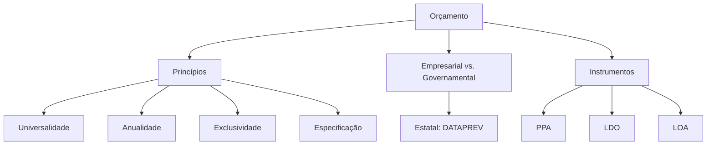

# Princípios Orçamentários

## 1 Introdução

Orçamento é a disciplina com o **recorte mais híbrido** do DATAPREV Perfil 10: mistura orçamento empresarial (especialmente de estatal) com orçamento governamental (LOA, PPA, LDO). A FGV contextualiza em estatal, então é crucial entender como a DATAPREV elabora e executa seu orçamento.

**Tempo médio recomendado**: 60 minutos.

**Pré-requisitos**: Nenhum. Este é o primeiro capítulo da disciplina.

## 2 Objetivos

Ao final deste capítulo, você será capaz de:

- Listar e explicar os princípios orçamentários clássicos.
- Distinguir orçamento empresarial de orçamento governamental.
- Identificar as especificidades da proposta orçamentária de estatal.
- Reconhecer os instrumentos de planejamento governamental (LOA, PPA, LDO).

## 3 Conhecimentos Prévios

Nenhum. Capítulo introdutório.

## 4 Desenvolvimento

### 4.1 Princípios Orçamentários Clássicos

| Princípio | Definição | Aplicação |
|-----------|-----------|-----------|
| **Universalidade** | O orçamento deve conter **todas** as receitas e despesas, sem exceção. | Nenhuma receita ou despesa pode ficar de fora do orçamento. |
| **Anualidade** | O orçamento deve ser aprovado para **um exercício financeiro** (1º de janeiro a 31 de dezembro). | Impede compromissos de longo prazo sem autorização anual. |
| **Exclusividade** | O orçamento não pode conter dispositivos estranhos à previsão de receitas e fixação de despesas. | O orçamento não é lei omnibus. |
| **Especificação** | As despesas devem ser discriminadas por **natureza econômica** (elemento de despesa). | Impede dotações genéricas. |
| **Unidade** | O orçamento deve ser **único** para cada ente (um só orçamento por exercício). | Evide orçamentos múltiplos paralelos. |
| **Equilírio** | As despesas não podem exceder as receitas previstas. | Impede déficit orçamentário sem autorização. |
| **Transparência** | O orçamento deve ser de fácil compreensão e acesso público. | Publicidade das informações orçamentárias. |

> [!attention]
> A FGV adora misturar os princípios. "Universalidade" é "tudo no orçamento"; "Especificação" é "detalhado por natureza". Não confunda os dois!

### 4.2 Orçamento Empresarial vs. Governamental

| Aspecto | Orçamento Empresarial | Orçamento Governamental |
|---------|----------------------|------------------------|
| **Objetivo** | Maximizar lucro / valor | Alocar recursos públicos |
| **Flexibilidade** | Mais flexível, adaptável ao mercado | Rígido, vinculado a lei |
| **Base** | Projeções de mercado e vendas | Receitas tributárias e metas de arrecadação |
| **Controle** | Gestão interna e acionistas | Controle externo (Tribunal de Contas) |
| **Aprovação** | Diretoria / Conselho | Congresso / Legislativo |

### 4.3 Orçamento de Estatal (DATAPREV)

A DATAPREV é uma **empresa pública**, sujeita à Lei das Estatais (Lei 13.303/2016) e ao regime orçamentário do setor público. Sua proposta orçamentária deve:

- Ser elaborada conforme diretrizes do acionista (União).
- Contemplar metas de resultado, investimentos e pessoal.
- Respeitar os princípios orçamentários e as normas do TCU.
- Ser aprovada pelo Conselho de Administração.

> [!trap]
> A FGV contextualiza em estatal: "A proposta orçamentária da DATAPREV deve ser aprovada pelo Congresso Nacional?" → **Falso**. Aprovação é do Conselho de Administração, não do Congresso. O Congresso aprova o orçamento da União, não das estatais individualmente.

### 4.4 Instrumentos de Planejamento Governamental

| Instrumento | Sigla | O que é | Prazo |
|-------------|-------|---------|-------|
| **Plano Plurianual** | PPA | Diretrizes, objetivos e metas de médio prazo (4 anos). | 4 anos |
| **Lei de Diretrizes Orçamentárias** | LDO | Metas e prioridades do orçamento do ano seguinte. | Anual |
| **Lei Orçamentária Anual** | LOA | Fixa receitas e despesas do exercício. | Anual |

**Relação hierárquica**: PPA (4 anos) → LDO (diretrizes anuais) → LOA (orçamento anual)

## 5 Exemplos

1. Uma despesa orçamentária discriminada apenas como "despesas diversas" viola o princípio da **especificação**.
2. A inclusão de uma autorização para contratação de pessoal na LOA viola o princípio da **exclusividade** (a LOA não é lei de pessoal).
3. A DATAPREV deve alinhar seu orçamento ao PPA e às diretrizes do acionista (União).

## 6 Erros Frequentes

- Confundir os princípios orçamentários entre si.
- Achar que estatais federais aprovam orçamento no Congresso.
- Esquecer que o PPA tem prazo de 4 anos, não anual.
- Confundir LDO (diretrizes) com LOA (orçamento em si).

## 7 Como a FGV Cobra

A FGV cobra orçamento com **contextualização em estatal**:
- "Qual princípio orçamentário exige que todas as receitas e despesas constem do orçamento?"
- "Qual a relação entre PPA, LDO e LOA?"
- "Quem aprova a proposta orçamentária da DATAPREV?"

## 8 Questões Comentadas

*(Questões serão adicionadas na fase de produção de conteúdo.)*

## 9 Questões para Resolver

*(Serão disponibilizadas em breve.)*

## 10 Resumo Executivo

- **Princípios**: universalidade, anualidade, exclusividade, especificação, unidade, equilíbrio, transparência.
- **Estatal**: orçamento aprovado pelo Conselho de Administração, alinhado ao PPA/União.
- **Instrumentos**: PPA (4 anos) → LDO (diretrizes) → LOA (orçamento anual).
- **FGV**: contextualiza em DATAPREV; cuidado com aprovação e princípios.

## 11 Mapa Mental

## 12 Flashcards

*(Flashcards serão adicionados na fase de produção de conteúdo.)*

## 13 Checklist

- [ ] Sei listar e explicar os 7 princípios orçamentários.
- [ ] Sei distinguir orçamento empresarial de governamental.
- [ ] Sei explicar as especificidades da proposta orçamentária de estatal.
- [ ] Sei relacionar PPA, LDO e LOA.
- [ ] Sei reconhecer pegadinhas da FGV sobre aprovação orçamentária.

## 14 Glossário

- **LOA**: Lei Orçamentária Anual — fixa receitas e despesas do exercício.
- **PPA**: Plano Plurianual — diretrizes de médio prazo (4 anos).
- **LDO**: Lei de Diretrizes Orçamentárias — metas e prioridades anuais.
- **Exclusividade**: princípio que impede a inclusão de matérias estranhas no orçamento.
- **Especificação**: discriminação por elemento de despesa.

## 15 Referências

- Lei 13.303/2016 (Lei das Estatais).
- Constituição Federal, art. 165.
- Lei Complementar 101/2000 (Lei de Responsabilidade Fiscal — LRF).
- Araújo, Jorge César de. *Orçamento Público: Teoria e Prática*. 10ª ed. São Paulo: Atlas, 2019.
