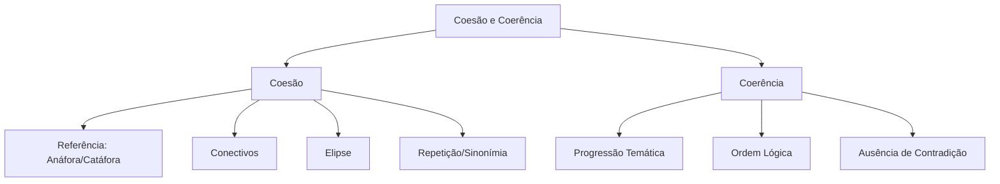

# Coesão e Coerência

## 1 Introdução

Coesão e coerência são os **mecanismos que tornam um texto compreensível**. Na prova da FGV, esse tópico aparece tanto em questões de interpretação textual quanto em questões de **reorganização de períodos** e **reescrita**. Dominar os conectivos e os mecanismos de referência é fundamental.

**Tempo médio recomendado**: 90 minutos.

**Pré-requisitos**: Sintaxe (termos da oração); Morfologia (pronomes, advérbios).

## 2 Objetivos

Ao final deste capítulo, você será capaz de:

- Distinguir coesão (gramatical) de coerência (semântica).
- Identificar e classificar os mecanismos de coesão textual.
- Reconhecer a função dos conectivos e a relação entre as ideias.
- Resolver questões de reorganização de períodos e reescrita.

## 3 Conhecimentos Prévios

- Pronomes pessoais, demonstrativos, relativos, possessivos.
- Advérbios e locuções adverbiais.
- Estrutura da oração simples e composta.

## 4 Desenvolvimento

### 4.1 Coesão vs. Coerência

| Conceito | Definição | Exemplo |
|----------|-----------|---------|
| **Coesão** | Ligação **gramatical** entre as partes do texto. É a forma. | Uso de pronomes, conectivos, elipses. |
| **Coerência** | Ligação **semântica** de sentido entre as ideias. É o conteúdo. | As ideias fazem sentido juntas; não se contradizem. |

Um texto pode ter coesão sem coerência: *"O gato mordeu a mesa. Ela estava feliz. Portanto, choveu."* — as frases estão gramaticalmente ligadas, mas semanticamente não fazem sentido.

### 4.2 Mecanismos de Coesão

#### 4.2.1 Referência (Pronomes)

| Tipo | Função | Exemplo |
|------|--------|---------|
| **Anáfora** | Pronome retoma termo anterior | "O **candidato** chegou. **Ele** estava nervoso." |
| **Catáfora** | Pronome antecipa termo posterior | "**Ela** chegou. A **candidata** estava nervosa." |
| **Déixis** | Pronome aponta para contexto | "**Isso** é importante" (o que foi dito antes) |

> [!attention]
> A FGV cobra **referência** em questões de interpretação: "O pronome 'ele' na segunda frase refere-se a...". Leia o contexto, não a frase isolada.

#### 4.2.2 Conectivos

| Relação | Conectivos | Exemplo |
|---------|------------|---------|
| **Adição** | e, além disso, também, além do mais | "Estudou. **Além disso**, fez exercícios." |
| **Oposição** | mas, porém, contudo, todavia, no entanto | "Estudou, **porém** não passou." |
| **Causa** | porque, pois, uma vez que, já que, visto que | "**Como** chovia, ficou em casa." |
| **Consequência** | portanto, logo, assim, por isso, então | "Choveu. **Portanto**, ficou em casa." |
| **Condição** | se, caso, desde que, contanto que | "**Se** chover, ficarei em casa." |
| **Finalidade** | para que, a fim de que, porque | "Estudou **para que** passasse." |
| **Tempo** | quando, enquanto, antes, depois, assim que | "**Quando** chegou, começou a estudar." |
| **Modo** | como, conforme, segundo | "**Conforme** previsto, a prova foi difícil." |

> [!trap]
> A FGV troca conectivos de relação em alternativas parcialmente corretas. Ex: trocar "porque" (causa) por "portanto" (consequência) muda completamente o sentido. Verifique sempre a **relação lógica** antes de marcar.

#### 4.2.3 Elipse

A **elipse** é a omissão de um termo já mencionado ou facilmente recuperável pelo contexto.

- "O candidato estudou e [o candidato] passou." (elipse do sujeito)
- "Gosto de chocolate, mas [gosto] mais de sorvete." (elipse do verbo)

> [!attention]
> Em questões de reorganização de períodos, a elipse pode causar ambiguidade. O termo omitido deve ser facilmente recuperável.

#### 4.2.4 Repetição e Sinonímia

- **Repetição**: retoma o mesmo termo para ênfase. "A DATAPREV é uma estatal. A DATAPREV gere a previdência."
- **Sinonímia**: substitui por termo equivalente. "A DATAPREV é uma estatal. A empresa gere a previdência."

### 4.3 Coerência Textual

A coerência exige que:
1. As ideias não se contradigam.
2. Haja progressão temática (o assunto avança, não fica repetindo).
3. O tema seja mantido (não haver desvios abruptos).

**Progressão temática:**
- **Tema → rema**: a informação nova (rema) vira tema da próxima frase.
- Ex: "O candidato **chegou** (rema). **Ele** (tema) **estava nervoso** (rema)."

### 4.4 Reorganização de Períodos

Questões da FGV exigem reorganizar frases para formar um texto coeso e coerente.

**Estratégia:**
1. Identifique a frase que apresenta o **tema geral** (vai primeiro).
2. Procure **conectivos** que indicam continuidade, oposição ou consequência.
3. Verifique **referências pronominais** — um pronome geralmente não pode vir antes do termo a que se refere.
4. Confira se a **ordem lógica** faz sentido (causa → consequência; problema → solução).

> [!trap]
> A FGV costuma colocar uma frase que parece ser a primeira, mas na verdade contém um pronome que depende de informação anterior. Sempre verifique se há "ele", "isso", "tal" no início — se houver, essa frase provavelmente não é a primeira.

## 5 Exemplos

1. Reorganização:
   - (1) "A DATAPREV foi criada em 1974."
   - (2) "**Ela** é responsável pela gestão da previdência social."
   - (3) "**Portanto**, desempenha papel estratégico no Brasil."
   
   Ordem correta: 1 → 2 → 3 ("Ela" em 2 refere-se a "DATAPREV" em 1; "Portanto" em 3 é consequência).

2. Conectivo:
   - "O candidato estudou muito. **No entanto**, não passou."
   - Relação: **oposição**.

## 6 Erros Frequentes

- Trocar conectivos de relação (causa por consequência, oposição por adição).
- Não identificar a referência pronominal correta.
- Colocar uma frase com pronome no início da reorganização.
- Ignorar a progressão temática (ficar repetindo a mesma ideia).

## 7 Como a FGV Cobra

A FGV cobra coesão/coerência em:
- **Reorganização de períodos**: ordene as frases para formar um texto coeso.
- **Reescrita**: substitua a expressão sublinhada por outra que mantenha a coerência.
- **Interpretação**: "A palavra 'isso' no terceiro parágrafo refere-se a..."

## 8 Questões Comentadas

### Questão 1 (FGV — adaptada)

Reorganize as frases abaixo para formar um texto coeso e coerente:

(1) **Ela** foi criada em 1974 para informatizar o processamento de dados da previdência social.
(2) A DATAPREV é uma empresa pública federal vinculada ao Ministério da Previdência Social.
(3) **Hoje**, a empresa é responsável pela gestão de informações de milhões de brasileiros.
(4) **Por isso**, desempenha um papel estratégico no sistema de seguridade social do país.

A ordem correta é:

a) 1 — 2 — 3 — 4
b) 2 — 1 — 3 — 4
c) 2 — 3 — 1 — 4
d) 3 — 2 — 1 — 4
e) 4 — 2 — 1 — 3

**Gabarito: B**

**Comentário:**

1. **Frase 2** vem primeiro porque apresenta o **tema** (DATAPREV) sem referências pronominais.
2. **Frase 1** segue com **"Ela"** (anáfora retomando "DATAPREV").
3. **Frase 3** continua com **"Hoje"** (marca temporal) e **"a empresa"** (sinonímia, evitando repetição).
4. **Frase 4** fecha com **"Por isso"** (conectivo de consequência), concluindo o raciocínio.

> [!attention]
> A FGV sempre coloca uma frase que parece ser a primeira (como a 3: "Hoje, a empresa...") mas que depende de informação anterior ("a empresa" só faz sentido depois de mencionar a DATAPREV). A dica: frases com pronomes ou artigos definidos ("ela", "a empresa", "por isso") raramente começam o texto.

---

### Questão 2 (FGV — adaptada)

No trecho *"O projeto de lei foi aprovado. **Isso** representa uma vitória para o governo. **Contudo**, a oposição já anunciou que recorrerá à Justiça."*, os conectivos/grifos destacados estabelecem, respectivamente, as relações de:

a) Consequência — oposição.
b) Conclusão — adição.
c) Explicação — oposição.
d) Consequência — concessão.
e) Conclusão — oposição.

**Gabarito: A**

**Comentário:**

1. **"Isso"** (pronome demonstrativo) retoma a ideia anterior (aprovação do projeto) e estabelece uma relação de **consequência** → a aprovação **resulta em** vitória.
2. **"Contudo"** é um conectivo de **oposição** → contrapõe a vitória do governo à ação da oposição.

> [!trap]
> Muitos candidatos confundem "contudo" com "conclusão" ("logo", "portanto"). "Contudo" sempre introduz uma ideia contrária à anterior. "Contudo" = "porém" = "todavia" = oposição.

*(Questões serão adicionadas na fase de produção de conteúdo.)*

## 9 Questões para Resolver

### Questão 3

Reorganize as frases para formar um texto coeso:

(1) **Ele** representa uma revolução na forma como interagimos com máquinas.
(2) A inteligência artificial está transformando diversos setores da economia.
(3) **No entanto**, esse avanço também levanta questões éticas importantes.
(4) **Por exemplo**, na saúde, algoritmos já auxiliam no diagnóstico de doenças.

A ordem correta é:

a) 2 — 1 — 4 — 3
b) 1 — 2 — 4 — 3
c) 2 — 4 — 1 — 3
d) 4 — 2 — 1 — 3
e) 2 — 1 — 3 — 4

**Gabarito: A**

---

### Questão 4

No trecho *"O projeto foi cancelado. **Consequentemente**, todos os funcionários foram realocados. **Embora** houvesse resistência inicial, a transição ocorreu sem maiores problemas."*, os conectivos destacados expressam, respectivamente:

a) Causa — concessão.
b) Consequência — concessão.
c) Conclusão — oposição.
d) Consequência — condição.
e) Adição — concessão.

**Gabarito: B**

*(Serão disponibilizadas em breve.)*

## 10 Resumo Executivo

- **Coesão**: ligação gramatical (pronomes, conectivos, elipses).
- **Coerência**: ligação semântica (sentido, progressão temática).
- **Conectivos**: identifique a relação lógica (adição, oposição, causa, consequência, etc.).
- **Reorganização**: tema primeiro, verifique pronomes e conectivos.
- **Referência**: pronomes retomam termos do contexto; nunca isolados.

## 11 Mapa Mental

## 12 Flashcards

*(Flashcards serão adicionados na fase de produção de conteúdo.)*

## 13 Checklist

- [ ] Sei distinguir coesão de coerência.
- [ ] Sei identificar anáfora, catáfora e déixis.
- [ ] Sei classificar conectivos por relação lógica.
- [ ] Sei aplicar a estratégia de reorganização de períodos.
- [ ] Sei resolver questões de referência pronominal.
- [ ] Sei reconhecer pegadinhas da FGV sobre conectivos trocados.

## 14 Glossário

- **Coesão**: conjunto de relações formais que ligam as partes de um texto.
- **Coerência**: conjunto de relações de sentido que tornam o texto compreensível.
- **Anáfora**: retomada de termo por pronome ou sinônimo após sua primeira menção.
- **Catáfora**: antecipação de termo por pronome antes de sua menção explícita.
- **Elipse**: omissão de termo recuperável pelo contexto.

## 15 Referências

- Koch, Ingedore Grunfeld Villaça. *A Coesão Textual*. 26ª ed. São Paulo: Contexto, 2018.
- Fávero, Leonor Lopes; Koch, Ingedore G. V. *Linguística Textual: Introdução*. 8ª ed. São Paulo: Cortez, 2019.
- Cegalla, Domingos Paschoal. *Gramática Refenciada da Língua Portuguesa*. São Paulo: Companhia Editora Nacional, 2016.
