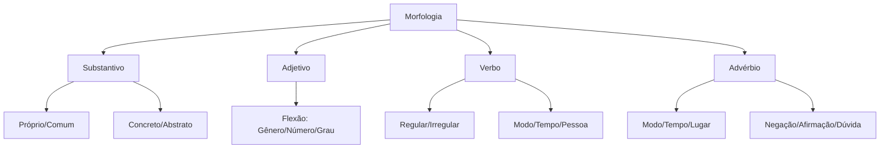

# Morfologia — Classes de Palavras

## 1 Introdução

A Morfologia é a parte da Gramática que estuda a **estrutura interna das palavras**, suas classes, flexões e processos de formação. No concurso DATAPREV (Perfil 10), a banca FGV cobra com frequência a identificação de classes gramaticais em contexto, regência verbal e concordância.

**Tempo médio recomendado**: 90 minutos.

**Pré-requisitos**: Nenhum. Este é o primeiro capítulo da disciplina.

## 2 Objetivos

Ao final deste capítulo, você será capaz de:

- Classificar qualquer palavra em sua classe gramatical.
- Identificar flexões de gênero, número, grau, modo, tempo e pessoa.
- Distinguir adjetivos de advérbios em qualquer contexto.
- Reconhecer pronomes e suas funções sintáticas.

## 3 Conhecimentos Prévios

Nenhum. Este capítulo é introdutório.

## 4 Desenvolvimento

### 4.1 Substantivo

O **substantivo** é a palavra que nomeia seres, objetos, lugares, sentimentos, ações, estados.

**Classificação**:

- **Próprio**: nomes específicos (Brasil, Maria, Amazonas).
- **Comum**: nomes genéricos (país, mulher, rio).
- **Concreto**: existem independentemente (mesa, amor, cachorro).
- **Abstrato**: dependem de outros seres (beleza, corrida, saudade).
- **Coletivo**: designam grupos (arquipélago, biblioteca, cardume).

> [!attention]
> A FGV adora confundir **substantivo abstrato** com **verbo no infinitivo**. "Corrida" é substantivo; "correr" é verbo. A função na frase decide.

### 4.2 Adjetivo

O **adjetivo** caracteriza ou determina o substantivo.

**Flexões**:

- **Gênero**: bonito / bonita
- **Número**: bonito / bonitos
- **Grau**: comparativo (mais bonito) e superlativo (o mais bonito, lindíssimo)

> [!trap]
> O superlativo absoluto sintético exige mudança radical: bom → ótimo, mau → péssimo, grande → máximo. A FGV cobra isso direto.

### 4.3 Verbo

O **verbo** exprime ação, estado ou fenômeno da natureza.

**Classificação morfológica**:

| Tipo | Exemplo | Característica |
|------|---------|---------------|
| Regulares | amar, correr, partir | Seguem o modelo de sua conjugação |
| Irregulares | ser, ir, dar, estar | Apresentam alterações na raiz ou terminação |
| Defectivos |reaver, abolir | Não se conjugam em todas as formas |
| Abundantes | matar / matou, matara | Possuem mais de uma forma com mesmo valor |
| Anomalous | ir, ser, estar | Conjugam-se de forma própria |

### 4.4 Advérbio

O **advérbio** modifica o verbo, o adjetivo ou outro advérbio.

**Classes de advérbios**:

- **Modo**: bem, mal, assim, devagar
- **Tempo**: ontem, hoje, agora, já, ainda
- **Lugar**: aqui, ali, acolá, longe, perto
- **Negação**: não, nunca, jamais
- **Afirmação**: sim, certamente, realmente
- **Dúvida**: talvez, quiçá, possivelmente

> [!attention]
> **Cuidado!** Palavras como "bem" e "mal" são advérbios de modo. Quando substantivados ("o bem", "o mal"), viram substantivos abstratos. A FGV ama essa troca.

## 5 Exemplos

1. *O candidato **estudou** bem para a prova.* → "estudou" = verbo; "bem" = advérbio de modo.
2. *A **beleza** da língua portuguesa é inegável.* → "beleza" = substantivo abstrato.
3. *Os **bons** funcionários são valorizados.* → "bons" = adjetivo (flexionado em gênero, número, grau).

## 6 Erros Frequentes

- Confundir **advérbio** com **adjetivo**: "Ele é muito **inteligente**" (adjetivo) vs. "Ele fala **muito**" (advérbio).
- Esquecer que **artigo** é classe gramatical independente (não é adjetivo!).
- Confundir **substantivo** com **verbo no infinitivo**: "o dever" (substantivo) vs. "dever" (verbo).

## 7 Como a FGV Cobra

A FGV adora questões de **classificação gramatical em contexto**. O truque é: não olhe só a palavra isolada, olhe a **função que ela exerce na oração**.

**Palavras-chave da banca**: "na oração acima", "exerce a função de", "é classificação correta".

## 8 Questões Comentadas

*(Questões serão adicionadas na fase de produção de conteúdo.)*

## 9 Questões para Resolver

*(Serão disponibilizadas em breve.)*

## 10 Resumo Executivo

- **Substantivo**: nomeia seres, objetos, ações, estados.
- **Adjetivo**: caracteriza o substantivo (flexiona em gênero, número, grau).
- **Verbo**: expressa ação, estado ou fenômeno (flexiona em modo, tempo, pessoa, número).
- **Advérbio**: modifica verbo, adjetivo ou outro advérbio (não flexiona!).

## 11 Mapa Mental

## 12 Flashcards

*(Flashcards serão adicionados na fase de produção de conteúdo.)*

## 13 Checklist

- [ ] Sei classificar substantivos (próprio/comum, concreto/abstrato).
- [ ] Sei flexionar adjetivos em gênero, número e grau.
- [ ] Sei identificar verbos e suas classificações morfológicas.
- [ ] Sei distinguir advérbio de adjetivo em qualquer contexto.
- [ ] Sei reconhecer as pegadinhas da FGV sobre classes gramaticais.

## 14 Glossário

- **Flexão**: alteração na forma da palavra para expressar gênero, número, grau, tempo, modo ou pessoa.
- **Regência**: relação de dependência entre palavras (ex: verbo + preposição + complemento).
- **Conjugação**: conjunto de todas as formas de um verbo.

## 15 Referências

- Cegalla, Domingos Paschoal. *Gramática Refenciada da Língua Portuguesa*. São Paulo: Companhia Editora Nacional, 2016.
- Bechara, Evanildo. *Gramática Escolar da Língua Portuguesa*. São Paulo: Lucerna, 2022.
- Cegalla, Domingos Paschoal. *Novíssima Gramática da Língua Portuguesa*. São Paulo: Companhia Editora Nacional, 2019.
