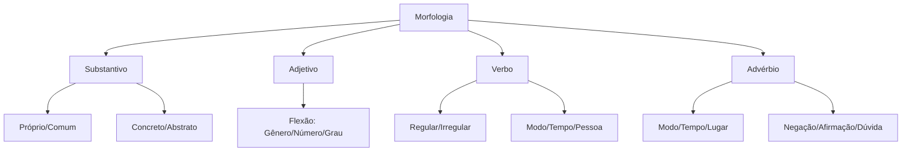

# Morfologia — Classes de Palavras

## 1 Introdução

A Morfologia é a parte da Gramática que estuda a **estrutura interna das palavras**, suas classes, flexões e processos de formação. No concurso DATAPREV (Perfil 10), a banca FGV cobra com frequência a identificação de classes gramaticais em contexto, regência verbal e concordância.

**Tempo médio recomendado**: 90 minutos.

**Pré-requisitos**: Nenhum. Este é o primeiro capítulo da disciplina.

## 2 Objetivos

Ao final deste capítulo, você será capaz de:

- Classificar qualquer palavra em sua classe gramatical.
- Identificar flexões de gênero, número, grau, modo, tempo e pessoa.
- Distinguir adjetivos de advérbios em qualquer contexto.
- Reconhecer pronomes e suas funções sintáticas.

## 3 Conhecimentos Prévios

Nenhum. Este capítulo é introdutório.

## 4 Desenvolvimento

### 4.1 Substantivo

O **substantivo** é a palavra que nomeia seres, objetos, lugares, sentimentos, ações, estados.

**Classificação**:

- **Próprio**: nomes específicos (Brasil, Maria, Amazonas).
- **Comum**: nomes genéricos (país, mulher, rio).
- **Concreto**: existem independentemente (mesa, amor, cachorro).
- **Abstrato**: dependem de outros seres (beleza, corrida, saudade).
- **Coletivo**: designam grupos (arquipélago, biblioteca, cardume).

> [!attention]
> A FGV adora confundir **substantivo abstrato** com **verbo no infinitivo**. "Corrida" é substantivo; "correr" é verbo. A função na frase decide.

### 4.2 Adjetivo

O **adjetivo** caracteriza ou determina o substantivo.

**Flexões**:

- **Gênero**: bonito / bonita
- **Número**: bonito / bonitos
- **Grau**: comparativo (mais bonito) e superlativo (o mais bonito, lindíssimo)

> [!trap]
> O superlativo absoluto sintético exige mudança radical: bom → ótimo, mau → péssimo, grande → máximo. A FGV cobra isso direto.

### 4.3 Verbo

O **verbo** exprime ação, estado ou fenômeno da natureza.

**Classificação morfológica**:

| Tipo | Exemplo | Característica |
|------|---------|---------------|
| Regulares | amar, correr, partir | Seguem o modelo de sua conjugação |
| Irregulares | ser, ir, dar, estar | Apresentam alterações na raiz ou terminação |
| Defectivos |reaver, abolir | Não se conjugam em todas as formas |
| Abundantes | matar / matou, matara | Possuem mais de uma forma com mesmo valor |
| Anomalous | ir, ser, estar | Conjugam-se de forma própria |

### 4.4 Advérbio

O **advérbio** modifica o verbo, o adjetivo ou outro advérbio.

**Classes de advérbios**:

- **Modo**: bem, mal, assim, devagar
- **Tempo**: ontem, hoje, agora, já, ainda
- **Lugar**: aqui, ali, acolá, longe, perto
- **Negação**: não, nunca, jamais
- **Afirmação**: sim, certamente, realmente
- **Dúvida**: talvez, quiçá, possivelmente

> [!attention]
> **Cuidado!** Palavras como "bem" e "mal" são advérbios de modo. Quando substantivados ("o bem", "o mal"), viram substantivos abstratos. A FGV ama essa troca.

## 5 Exemplos

1. *O candidato **estudou** bem para a prova.* → "estudou" = verbo; "bem" = advérbio de modo.
2. *A **beleza** da língua portuguesa é inegável.* → "beleza" = substantivo abstrato.
3. *Os **bons** funcionários são valorizados.* → "bons" = adjetivo (flexionado em gênero, número, grau).

## 6 Erros Frequentes

- Confundir **advérbio** com **adjetivo**: "Ele é muito **inteligente**" (adjetivo) vs. "Ele fala **muito**" (advérbio).
- Esquecer que **artigo** é classe gramatical independente (não é adjetivo!).
- Confundir **substantivo** com **verbo no infinitivo**: "o dever" (substantivo) vs. "dever" (verbo).

## 7 Como a FGV Cobra

A FGV adora questões de **classificação gramatical em contexto**. O truque é: não olhe só a palavra isolada, olhe a **função que ela exerce na oração**.

**Palavras-chave da banca**: "na oração acima", "exerce a função de", "é classificação correta".

## 8 Questões Comentadas

### Questão 1 (FGV — adaptada)

Leia o trecho abaixo:

> *"O candidato **estudou** muito para alcançar a **aprovção**. O **sucesso** na prova exige **dedicação** constante."*

Assinale a alternativa que apresenta a classificação morfológica correta das palavras destacadas, na ordem em que aparecem.

a) Verbo, substantivo abstrato, substantivo abstrato, substantivo abstrato.
b) Verbo, substantivo concreto, substantivo abstrato, substantivo abstrato.
c) Substantivo, substantivo abstrato, substantivo concreto, substantivo abstrato.
d) Verbo, substantivo abstrato, substantivo concreto, substantivo concreto.
e) Verbo, substantivo concreto, substantivo concreto, substantivo abstrato.

**Gabarito: A**

**Comentário:**

1. **"estudou"** → Verbo (expressa ação, flexionado em tempo/pessoa).
2. **"aprovção"** → Substantivo abstrato (nomeia uma qualidade/resultado, não existe independentemente; depende da ação de aprovar).
3. **"sucesso"** → Substantivo abstrato (estado/resultado, não é palpável).
4. **"dedicação"** → Substantivo abstrato (nomeia ação/qualidade de dedicar).

> [!attention]
> A FGV costuma colocar "aprovção" como alternativa para "substantivo concreto", explorando a semelhança com "prova" (concreto). Sempre pergunte: "Eu posso tocar isso?" Se não puder, é abstrato.

---

### Questão 2 (FGV — adaptada)

No trecho *"O **novo** funcionário trabalha **bem** e é **muito** eficiente"*, as palavras destacadas são, respectivamente:

a) Advérbio, advérbio, advérbio.
b) Adjetivo, advérbio, advérbio.
c) Adjetivo, advérbio, adjetivo.
d) Substantivo, advérbio, adjetivo.
e) Adjetivo, adjetivo, advérbio.

**Gabarito: B**

**Comentário:**

1. **"novo"** → Adjetivo (caracteriza o substantivo "funcionário"; flexiona em gênero/número: "nova funcionária").
2. **"bem"** → Advérbio de modo (modifica o verbo "trabalha"; invariável — não flexiona).
3. **"muito"** → Advérbio de intensidade (modifica o adjetivo "eficiente"; invariável neste contexto).

> [!trap]
> "Muito" pode ser pronome indefinido ("muitos estudantes"), advérbio ("muito bom") ou substantivo ("o muito"). A FGV ama essa troca. Veja o que a palavra modifica: se modifica substantivo → pronome; se modifica adjetivo/advérbio → advérbio; se substantivada → substantivo.

*(Questões serão adicionadas na fase de produção de conteúdo.)*

## 9 Questões para Resolver

### Questão 3

Assinale a alternativa em que todas as palavras destacadas são **substantivos abstratos**:

a) A **coragem** do soldado foi **elogiada**.
b) A **beleza** da **poesia** emociona qualquer **leitor**.
c) O **amor** e a **esperança** são **virtudes** essenciais.
d) A **mesa** de **madeira** era antiga.
e) O **carro** azul **chegou** cedo.

**Gabarito: C**

---

### Questão 4

No trecho *"Ela é **tão** inteligente que resolve **rápido** qualquer problema"*, as palavras destacadas são, respectivamente:

a) Advérbio de intensidade, advérbio de modo.
b) Adjetivo, advérbio de modo.
c) Advérbio de modo, adjetivo.
d) Pronome indefinido, advérbio de tempo.
e) Advérbio de intensidade, adjetivo.

**Gabarito: A**

*(Serão disponibilizadas em breve.)*

## 10 Resumo Executivo

- **Substantivo**: nomeia seres, objetos, ações, estados.
- **Adjetivo**: caracteriza o substantivo (flexiona em gênero, número, grau).
- **Verbo**: expressa ação, estado ou fenômeno (flexiona em modo, tempo, pessoa, número).
- **Advérbio**: modifica verbo, adjetivo ou outro advérbio (não flexiona!).

## 11 Mapa Mental

## 12 Flashcards

| # | Frente | Verso |
|---|--------|-------|
| 1 | O que é um substantivo abstrato? | Nomeia qualidades, estados ou ações que não existem independentemente (ex: beleza, corrida, saudade). |
| 2 | Qual a diferença entre "corrida" e "correr"? | "Corrida" é substantivo abstrato; "correr" é verbo. A função na frase decide. |
| 3 | O que caracteriza o advérbio? | Modifica verbo, adjetivo ou outro advérbio; é invariável. |
| 4 | Quando "bem" é advérbio e quando é substantivo? | Advérbio: "estudou bem"; Substantivo: "o bem". |
| 5 | O que é superlativo absoluto sintético? | Forma que exige mudança radical: bom → ótimo, mau → péssimo, grande → máximo. |
| 6 | Quais as flexões do adjetivo? | Gênero (bonito/bonita), número (bonito/bonitos), grau (comparativo/superlativo). |
| 7 | O que é verbo irregular? | Apresenta alterações na raiz ou terminação (ser, ir, dar, estar). |
| 8 | Quais as classes de advérbios? | Modo, tempo, lugar, negação, afirmação, dúvida. |

*(Flashcards serão adicionados na fase de produção de conteúdo.)*

## 13 Checklist

- [ ] Sei classificar substantivos (próprio/comum, concreto/abstrato).
- [ ] Sei flexionar adjetivos em gênero, número e grau.
- [ ] Sei identificar verbos e suas classificações morfológicas.
- [ ] Sei distinguir advérbio de adjetivo em qualquer contexto.
- [ ] Sei reconhecer as pegadinhas da FGV sobre classes gramaticais.

## 14 Glossário

- **Flexão**: alteração na forma da palavra para expressar gênero, número, grau, tempo, modo ou pessoa.
- **Regência**: relação de dependência entre palavras (ex: verbo + preposição + complemento).
- **Conjugação**: conjunto de todas as formas de um verbo.

## 15 Referências

- Cegalla, Domingos Paschoal. *Gramática Refenciada da Língua Portuguesa*. São Paulo: Companhia Editora Nacional, 2016.
- Bechara, Evanildo. *Gramática Escolar da Língua Portuguesa*. São Paulo: Lucerna, 2022.
- Cegalla, Domingos Paschoal. *Novíssima Gramática da Língua Portuguesa*. São Paulo: Companhia Editora Nacional, 2019.
