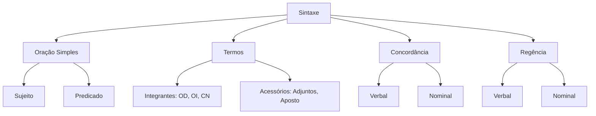

# Sintaxe — Termos da Oração

## 1 Introdução

A Sintaxe é a parte da Gramática que estuda a **organização das palavras na frase**. Para a FGV, este é um dos tópicos mais cobrados — especialmente regência verbal, concordância e análise sintática. Dominar a estrutura da oração é essencial para resolver questões de interpretação gramatical com segurança.

**Tempo médio recomendado**: 120 minutos.

**Pré-requisitos**: Morfologia (classes de palavras).

## 2 Objetivos

Ao final deste capítulo, você será capaz de:

- Identificar e classificar todos os termos da oração.
- Reconhecer a estrutura de orações simples e compostas.
- Aplicar regras de concordância verbal e nominal.
- Resolver questões de regência verbal e nominal da FGV.

## 3 Conhecimentos Prévios

- Classes gramaticais (substantivo, verbo, adjetivo, advérbio).
- Flexões verbais (modo, tempo, pessoa, número).

## 4 Desenvolvimento

### 4.1 Estrutura da Oração Simples

Toda oração tem **sujeito** e **predicado** (exceto orações sem sujeito, como "Chove").

**Sujeito**: quem ou o que pratica a ação verbal (ou de quem se declara algo).
- **Simples**: um núcleo (*"O **candidato** estudou."*)
- **Composto**: dois ou mais núcleos (*"O **candidato** e a **candidata** estudaram."*)
- **Omissos/Indeterminados**: implícito ou inexistente (*"**Estuda-se** muito para concurso."*)

**Predicado**: o que se declara sobre o sujeito.
- **Verbal-nominal**: tem verbo + predicativo (*"O candidato **chegou cansado**."*)
- **Verbal**: só verbo + complementos (*"O candidato **estudou a matéria**."*)
- **Nominal**: verbo de ligação + predicativo (*"O candidato **está preparado**."*)

### 4.2 Termos Essenciais

| Termo | Definição | Exemplo |
|-------|-----------|---------|
| **Sujeito** | Quem pratica a ação | "O **aluno** escreveu." |
| **Predicado** | O que se declara sobre o sujeito | "O aluno **escreveu a redação**." |
| **Verbo** | Núcleo do predicado | "O aluno **escreveu** a redação." |

### 4.3 Termos Integrantes

| Termo | Definição | Exemplo |
|-------|-----------|---------|
| **Objeto Direto** | Complemento sem preposição | "Estudei **a lei**." |
| **Objeto Indireto** | Complemento com preposição | "Obedeci **às regras**." |
| **Complemento Nominal** | Completa o sentido de nome | "Gosto **de chocolate**." |
| **Agente da Passiva** | Quem pratica a ação na voz passiva | "A lei foi aprovada **pelo Congresso**." |

> [!attention]
> A FGV cobra com frequência a distinção entre **objeto direto** e **predicativo**. "Ele elegeu **presidente**" → "presidente" é predicativo (atributo do objeto). "Ele viu **o presidente**" → "o presidente" é objeto direto.

### 4.4 Termos Acessórios

| Termo | Definição | Exemplo |
|-------|-----------|---------|
| **Adjunto Adverbial** | Circunstância (tempo, lugar, modo, causa) | "Estudei **ontem**." |
| **Adjunto Adnominal** | Caracteriza o substantivo | "A **nova** lei foi aprovada." |
| **Aposto** | Explica ou especifica | "Meu irmão, **o médico**, chegou." |
| **Vocativo** | Chamamento | "**Senhores**, atenção!" |

### 4.5 Concordância Verbal

**Regra geral**: o verbo concorda com o sujeito em número e pessoa.

**Casos especiais:**
- **Sujeito composto com verbos diferentes**: verbo no plural (*"O aluno e a aluna **estudaram**."*)
- **Sujeito posposto**: verbo pode concordar com o primeiro ou ir para o plural (*"Chegou o aluno e a aluna"* ou *"Chegaram o aluno e a aluna"*)
- **Sujeito com "como", "segundo"**: verbo concorda com o núcleo do sujeito (*"Como **foram** os alunos..."* — mas: *"Como **foi** o aluno..."*)
- **Expressões partitivas**: "A maioria dos alunos **estudou**" (verbo pode ir para singular ou plural — ambas são aceitas)

> [!trap]
> A FGV cobra **concordância com sujeito posposto** como pegadinha. Quando o sujeito vem depois do verbo, muitos candidatos concordam com o que vem antes. Ex: "**Chegou** os candidatos" ❌ (errado — sujeito é "os candidatos"). "**Chegaram** os candidatos" ✅.

### 4.6 Concordância Nominal

O adjetivo concorda em gênero e número com o substantivo que caracteriza.

**Casos especiais:**
- **Adjetivo para mais de um substantivo de gêneros diferentes**: vai para o masculino plural (*"O menino e a menina **são inteligentes**."*)
- **Adjetivo anteposto a substantivos de gêneros diferentes**: pode concordar com o mais próximo (*"**Belas** flores e jardim"* ou *"**Belo** jardim e flores"*)
- **Adjetivo por vírgula**: concorda com o substantivo mais próximo (*"Maria, **feliz**, saiu."*)

### 4.7 Regência Verbal

A **regência verbal** estuda a relação entre o verbo e seus complementos.

| Verbo | Regência | Exemplo |
|-------|----------|---------|
| **Assistir** | OD (assistir algo) ou OI (assistir a algo) | "Assisti **o filme**" / "Assisti **ao filme**" |
| **Obedecer** | OI (a) | "Obedeci **às regras**" |
| **Aspirar** | OD (ar) ou OI (a) | "Aspirei **o ar**" / "Aspiro **à vaga**" |
| **Implicar** | OI (em) ou OD | "Implico **em problemas**" / "Isso **implica** mudanças" |
| **Preferir** | OD | "Prefiro **o café**" |

> [!attention]
> A FGV adora os verbos com dupla regência: **aspirar** (ar x a), **chegar** (OD = alcançar; OI = a = chegar em algum lugar), **visar** (OD = mirar; OI = a = ter por objetivo). Quando há preposição, o sentido muda.

## 5 Exemplos

1. *"O candidato **estudou** a matéria **com afinco** **ontem**."*
   - Sujeito: "O candidato"
   - Predicado verbal: "estudou a matéria com afinco ontem"
   - OD: "a matéria"
   - Adjunto adverbial de modo: "com afinco"
   - Adjunto adverbial de tempo: "ontem"

2. *"**Choveu** muito **na província**."*
   - Oração sem sujeito (verbo impessoal)
   - Predicado: "choveu muito na província"

## 6 Erros Frequentes

- Confundir objeto direto com predicativo do objeto.
- Concordar o verbo com o que vem antes quando o sujeito está posposto.
- Esquecer que verbos impessoais (chover, anoitecer, fazer tempo) não têm sujeito.
- Aplicar regência verbal sem considerar o sentido (aspirar ar ≠ aspirar a).

## 7 Como a FGV Cobra

A FGV privilegia:
- **Análise sintática completa** (identificar sujeito, objeto, predicativo, adjuntos).
- **Concordância com sujeito posposto ou composto**.
- **Regência verbal com dupla regência**.
- **Voz passiva sintética** ("Aprovou-se a lei" = "A lei foi aprovada").

**Palavras-chave da banca**: "na oração acima", "exerce a função de", "a concordância correta é", "a regência verbal exige".

## 8 Questões Comentadas

### Questão 1 (FGV — adaptada)

No trecho *"Chegaram os candidatos e suas famílias para a cerimônia de posse"*, a concordância verbal está:

a) Incorreta, pois o verbo deveria estar no singular para concordar com o núcleo mais próximo.
b) Correta, pois o sujeito é composto e o verbo está no plural.
c) Incorreta, pois o verbo deveria concordar apenas com "famílias".
d) Correta, mas poderia estar no singular, já que "candidatos" é o núcleo principal.
e) Incorreta, pois em sujeito composto o verbo deve concordar com o último núcleo.

**Gabarito: B**

**Comentário:**

O sujeito é **composto** ("os candidatos e suas famílias" — dois núcleos ligados por "e"). Quando o sujeito é composto com verbos diferentes, o verbo vai para o plural: **"Chegaram"**.

> [!attention]
> A FGV coloca alternativas como A e E para confundir candidatos que memorizam regras sem entender o conceito. A regra é simples: sujeito composto = verbo no plural (exceto quando os núcleos formam um todo unitário, como "O criador e legislador é Deus").

---

### Questão 2 (FGV — adaptada)

No trecho *"Aprovou-se a lei que alterava as regras do concurso"*, o termo "Aprovou-se" está na:

a) Voz ativa, com sujeito indeterminado.
b) Voz passiva sintética, sendo "a lei" o sujeito paciente.
c) Voz passiva analítica, com agente da passiva omitido.
d) Voz reflexiva, com o sujeito praticando a ação sobre si mesmo.
e) Voz ativa, com pronome oblíquo átono como objeto direto.

**Gabarito: B**

**Comentário:**

A **voz passiva sintética** é formada pelo verbo transitivo direto + pronome se + sujeito paciente (sem agente da passiva). É equivalente à voz passiva analítica: "A lei foi aprovada" = "Aprovou-se a lei".

A estrutura é: **Verbo + se + Sujeito Paciente**.

> [!trap]
> Não confunda voz passiva sintética com sujeito indeterminado. No sujeito indeterminado, não há sujeito paciente identificável: "Diz-se que..." (quem diz? Não se sabe). Na passiva sintética, há sujeito paciente claro: "Aprovou-se **a lei**" (a lei foi aprovada por alguém).

*(Questões serão adicionadas na fase de produção de conteúdo.)*

## 9 Questões para Resolver

### Questão 3

No trecho *"A maioria dos estudantes **concluiu** o curso em tempo recorde"*, a concordância verbal está:

a) Incorreta, porque "a maioria" exige verbo no plural.
b) Correta, porque o verbo pode concordar com o núcleo "maioria" ou ir para o plural.
c) Incorreta, porque "estudantes" é plural e o verbo deveria acompanhá-lo.
d) Correta, mas apenas no registro coloquial.
e) Incorreta em qualquer circunstância.

**Gabarito: B**

---

### Questão 4

Assinale a alternativa em que o termo destacado é **objeto indireto**:

a) O candidato **estudou** a matéria.
b) Ela **deu** um livro ao amigo.
c) O juiz **condenou** o réu.
d) Nós **chegamos** cedo.
e) Eles **são** inteligentes.

**Gabarito: B**

*(Serão disponibilizadas em breve.)*

## 10 Resumo Executivo

- **Oração simples**: sujeito + predicado (verbo + complementos).
- **Termos integrantes**: OD, OI, CN, agente da passiva.
- **Termos acessórios**: adjunto adverbial, adjunto adnominal, aposto, vocativo.
- **Concordância**: verbo com sujeito; adjetivo com substantivo.
- **Regência**: relação de dependência entre verbo e complementos.

## 11 Mapa Mental

## 12 Flashcards

| # | Frente | Verso |
|---|--------|-------|
| 1 | Qual a regra geral de concordância verbal? | O verbo concorda com o sujeito em número e pessoa. |
| 2 | O que acontece com o verbo quando o sujeito é composto? | O verbo vai para o plural (exceto quando os núcleos formam um todo unitário). |
| 3 | Como concordar com sujeito posposto? | Concordar com o sujeito real, não com o que vem antes. Ex: "Chegaram os candidatos" (não "Chegou"). |
| 4 | Qual a diferença entre OD e predicativo do objeto? | OD: "Ele viu o presidente"; Predicativo: "Ele elegeu presidente". |
| 5 | O que é voz passiva sintética? | Verbo + se + sujeito paciente. Ex: "Aprovou-se a lei" = "A lei foi aprovada". |
| 6 | O que é agente da passiva? | Quem pratica a ação na voz passiva. Ex: "A lei foi aprovada pelo Congresso". |
| 7 | O que é complemento nominal? | Completa o sentido de um nome. Ex: "Gosto de chocolate". |
| 8 | Qual a diferença entre oração restritiva e explicativa? | Restritiva: sem vírgula, limita o sentido; Explicativa: com vírgula, acrescenta informação. |

*(Flashcards serão adicionados na fase de produção de conteúdo.)*

## 13 Checklist

- [ ] Sei identificar sujeito simples, composto e omitido.
- [ ] Sei classificar predicados em verbal, nominal e verbal-nominal.
- [ ] Sei distinguir OD, OI, CN e agente da passiva.
- [ ] Sei aplicar concordância verbal com sujeito posposto.
- [ ] Sei resolver questões de regência verbal com dupla regência.
- [ ] Sei reconhecer pegadinhas da FGV sobre análise sintática.

## 14 Glossário

- **Sintaxe**: parte da gramática que estuda a organização das palavras na oração.
- **Predicativo**: termo que atribui qualidade ao sujeito ou ao objeto.
- **Regência**: relação de dependência entre palavras (verbo + preposição + complemento).
- **Voz passiva**: construção em que o sujeito sofre a ação.

## 15 Referências

- Cegalla, Domingos Paschoal. *Gramática Refenciada da Língua Portuguesa*. São Paulo: Companhia Editora Nacional, 2016.
- Bechara, Evanildo. *Gramática Escolar da Língua Portuguesa*. São Paulo: Lucerna, 2022.
- Cegalla, Domingos Paschoal. *Novíssima Gramática da Língua Portuguesa*. São Paulo: Companhia Editora Nacional, 2019.
