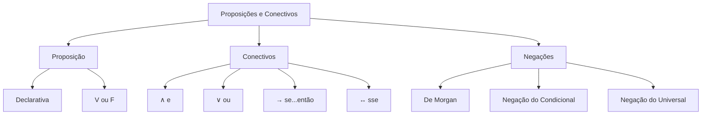

# Proposições e Conectivos

## 1 Introdução

Raciocínio Lógico é a disciplina que mais elimina candidatos no DATAPREV Perfil 10. São apenas 5 questões, mas **zerar elimina**. O primeiro passo é dominar proposições, conectivos e negações — a base de todo o restante.

**Tempo médio recomendado**: 60 minutos.

**Pré-requisitos**: Nenhum. Este é o primeiro capítulo da disciplina.

## 2 Objetivos

Ao final deste capítulo, você será capaz de:

- Identificar se uma sentença é proposição lógica.
- Reconhecer os cinco conectivos fundamentais e suas tabelas-verdade.
- Aplicar regras de negação e equivalência com segurança.
- Traduzir enunciados verbais para linguagem simbólica.

## 3 Conhecimentos Prévios

Nenhum. Capítulo introdutório.

## 4 Desenvolvimento

### 4.1 O que é uma Proposição?

Uma **proposição** é toda sentença declarativa que pode ser classificada em **verdadeira (V)** ou **falsa (F)**, mas não ambas.

**Exemplos de proposições:**
- "O Brasil é um país da América do Sul." (V)
- "2 + 2 = 5." (F)

**Não são proposições:**
- "Que horas são?" (interrogativa)
- "Feche a porta." (imperativa)
- "x + 3 = 7" (aberta — depende do valor de x)

### 4.2 Conectivos Lógicos

| Conectivo | Símbolo | Leitura | Valor V quando... |
|-----------|---------|---------|-------------------|
| Conjunção | ∧ | "e" | Ambas são V |
| Disjunção | ∨ | "ou" | Pelo menos uma é V |
| Condicional | → | "se...então" | Antecedente F ou consequente V |
| Bicondicional | ↔ | "se e somente se" | Ambas iguais (VV ou FF) |
| Negação | ¬ / ~ | "não" | Inverte o valor |

> [!attention]
> A FGV adora confundir **"e"** com **"ou"**. No português coloquial usamos "ou" como exclusivo (um ou outro, mas não ambos). Na lógica, "ou" é inclusivo: pode ser um, outro, ou ambos.

### 4.3 Tabelas-Verdade Básicas

Para duas proposições p e q:

| p | q | p ∧ q | p ∨ q | p → q | p ↔ q |
|---|---|-------|-------|-------|-------|
| V | V |   V   |   V   |   V   |   V   |
| V | F |   F   |   V   |   F   |   F   |
| F | V |   F   |   V   |   V   |   F   |
| F | F |   F   |   F   |   V   |   V   |

**Mnemônico para condicional:** "Se p, então q" só é falso quando p é V e q é F — ou seja, quando a promessa é quebrada.

### 4.4 Negações e Equivalências

**Negações fundamentais:**
- ¬(p ∧ q) ≡ ¬p ∨ ¬q (De Morgan)
- ¬(p ∨ q) ≡ ¬p ∧ ¬q (De Morgan)
- ¬(p → q) ≡ p ∧ ¬q
- ¬(p ↔ q) ≡ (p ∧ ¬q) ∨ (¬p ∧ q)

> [!trap]
> A negação de "Todo A é B" **não** é "Todo A não é B". A negação correta é **"Existe A que não é B"** (ou "Algum A não é B").

## 5 Exemplos

1. *"Se chover, então levarei o guarda-chuva."* → p = chover, q = levar guarda-chuva. p → q.
2. *"Não é verdade que João é médico e Maria é advogada."* → ¬(p ∧ q) ≡ ¬p ∨ ¬q.
3. *"Todo político é honesto."* → Negação: "Existe político que não é honesto."

## 6 Erros Frequentes

- Confundir a negação de uma conjunção com a conjunção das negações.
- Esquecer que p → q é equivalente a ¬p ∨ q.
- Aplicar a negação de "todo" incorretamente.
- Cair na armadilha de "se e somente se" tratando como condicional simples.

## 7 Como a FGV Cobra

A FGV **contextualiza** as questões: em vez de perguntar "Qual o valor de p ∧ q?", coloca um enunciado de 5 linhas sobre legislação ou situação administrativa e exige a tradução para símbolos lógicos. O erro mais comum é **ler com pressa e não identificar o conectivo correto**.

## 8 Questões Comentadas

### Questão 1 (FGV — adaptada)

Considere as seguintes afirmações:

I. "x + 5 = 10"
II. "O Rio de Janeiro é a capital do Brasil."
III. "Que horas são?"
IV. "Se chover, então a rua ficará molhada."

Quais são proposições lógicas?

a) Apenas II e IV.
b) Apenas II.
c) I, II e IV.
d) Apenas IV.
e) II, III e IV.

**Gabarito: A**

**Comentário:**

- **I.** "x + 5 = 10" → **Não é proposição** (sentença aberta: depende do valor de x).
- **II.** "O Rio de Janeiro é a capital do Brasil." → **É proposição** (F — mas é proposição porque pode ser classificada em V ou F).
- **III.** "Que horas são?" → **Não é proposição** (interrogativa).
- **IV.** "Se chover, então a rua ficará molhada." → **É proposição** (V — sentença declarativa).

> [!attention]
> Uma proposição pode ser **falsa** e ainda ser proposição. O critério é: sentença declarativa que pode ser classificada em V ou F. "x + 5 = 10" não é proposição porque não sabemos o valor de x.

---

### Questão 2 (FGV — adaptada)

A negação de "Todo servidor público é honesto" é:

a) Nenhum servidor público é honesto.
b) Todo servidor público é desonesto.
c) Todo servidor público não é honesto.
d) Algum servidor público não é honesto.
e) Nenhum servidor público é desonesto.

**Gabarito: D**

**Comentário:**

A negação de uma proposição universal afirmativa ("Todo A é B") é uma proposição particular negativa ("Algum A não é B").

- "Todo servidor é honesto" = universal afirmativa.
- Negação = "Existe pelo menos um servidor que não é honesto" = "Algum servidor não é honesto".

> [!trap]
> A alternativa A ("Nenhum servidor é honesto") é a negação de "Algum servidor é honesto", não de "Todo servidor é honesto". B e C são negações incorretas porque mantêm o quantificador universal ("Todo"). Para negar "todo", mude para "algum" + negação do predicado.

*(Questões serão adicionadas na fase de produção de conteúdo.)*

## 9 Questões para Resolver

### Questão 3

Sendo p e q proposições, qual das alternativas apresenta uma **tautologia**?

a) p ∧ ¬p
b) p ∨ ¬p
c) p → q
d) p ↔ ¬p
e) p ∧ q

**Gabarito: B**

---

### Questão 4

A proposição "Se o candidato estudar, então passará" é equivalente a:

a) O candidato estuda e passa.
b) O candidato não estuda ou passa.
c) O candidato estuda ou não passa.
d) O candidato não estuda e não passa.
e) O candidato estuda se e somente se passar.

**Gabarito: B**

*(Serão disponibilizadas em breve.)*

## 10 Resumo Executivo

- **Proposição**: sentença declarativa com valor V ou F.
- **Conectivos**: e (∧), ou (∨), se...então (→), se e somente se (↔), não (¬).
- **Negações**: De Morgan é a ferramenta mais cobrada.
- **Dica FGV**: leia o enunciado com calma, identifique proposições e conectivos antes de tentar resolver.

## 11 Mapa Mental

## 12 Flashcards

*(Flashcards serão adicionados na fase de produção de conteúdo.)*

## 13 Checklist

- [ ] Sei identificar se uma sentença é proposição.
- [ ] Sei construir tabelas-verdade para ∧, ∨, →, ↔.
- [ ] Sei aplicar as leis de De Morgan.
- [ ] Sei negar corretamente proposições universais.
- [ ] Sei traduzir enunciados verbais para símbolos lógicos.

## 14 Glossário

- **Proposição simples**: sentença com um único sujeito e predicado, sem conectivos.
- **Proposição composta**: combinação de proposições simples por conectivos.
- **Tautologia**: proposição composta sempre verdadeira.
- **Contradição**: proposição composta sempre falsa.

## 15 Referências

- Alencar Filho, Edgard de. *Iniciação à Lógica Matemática*. São Paulo: Nobel, 2019.
- Copi, Irving M. *Introdução à Lógica*. 2ª ed. São Paulo: Mestre Jou, 2018.
